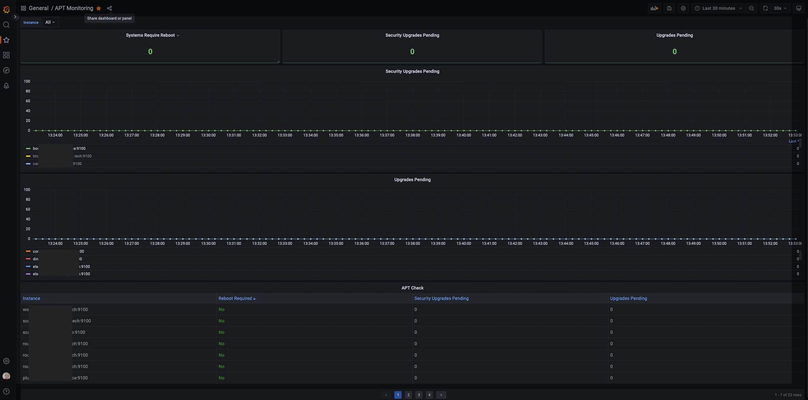

As soon you run a Linux server, you need to make sure your systems are up-to-date.
It would also be handy to know if you had Kernel upgrades which require a reboot of the system to get applied.

I came across a blog post from [Tom Henderson](https://tom-henderson.github.io/2020/12/04/apt-grafana-prometheus.html) which provided a solution using the Node_Exporter with Prometheus.
The way he solved this is pretty slick.
I had to tweak the scripts a bit to get it running.
He integrated an APT hook which runs a command on apt update and after installing packages.
The hooks create a Prometheus file which can be easily shipped with the Node_Exporter.

The high level steps are pretty straight forward.
1. Add a wrapper script which creates the `apt.prom` file format for you.
2. Install the apt hook.
3. Enable the text file collector and point it to your directory with the `apt.prom` file.
4. Scrape the Node_Exporter endpoint with Prometheus
5. Install the Grafana dashboard

I've collected the scripts and a Grafana dashboard you can use in the [apt-prometheus](https://github.com/labmonkeys-space/apt-prometheus) repository.

Feel free to fork - merry x-mas and have fun.

Featured image by [Renate Köppel](https://pixabay.com/users/renateko-15186262/?utm_source=link-attribution&amp;utm_medium=referral&amp;utm_campaign=image&amp;utm_content=6006042) from [Pixabay](https://pixabay.com//?utm_source=link-attribution&amp;utm_medium=referral&amp;utm_campaign=image&amp;utm_content=6006042).