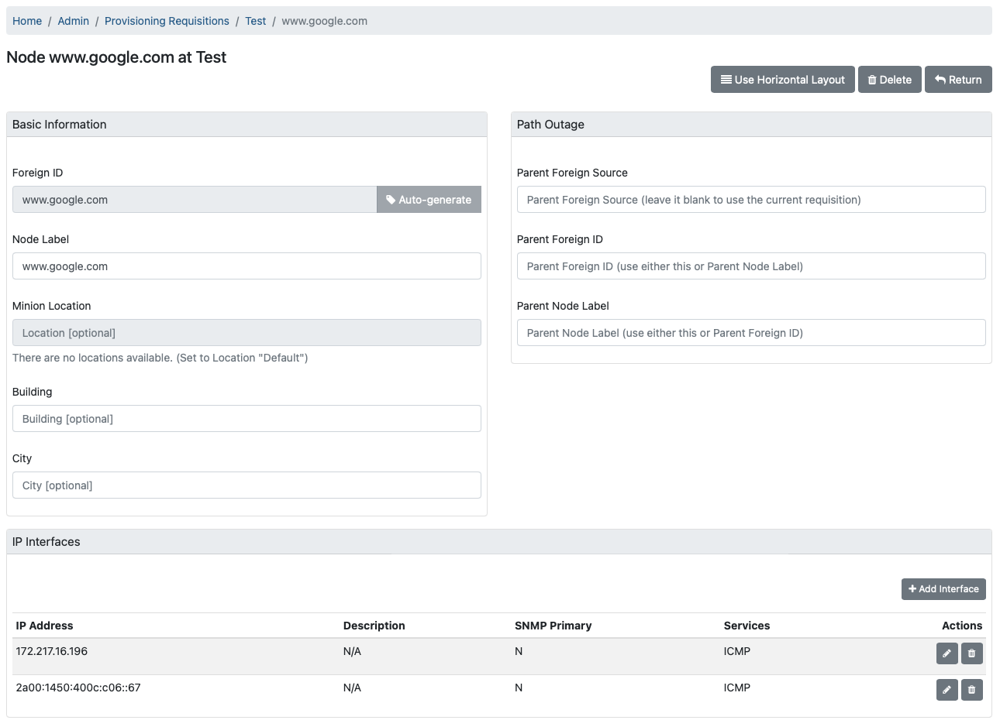
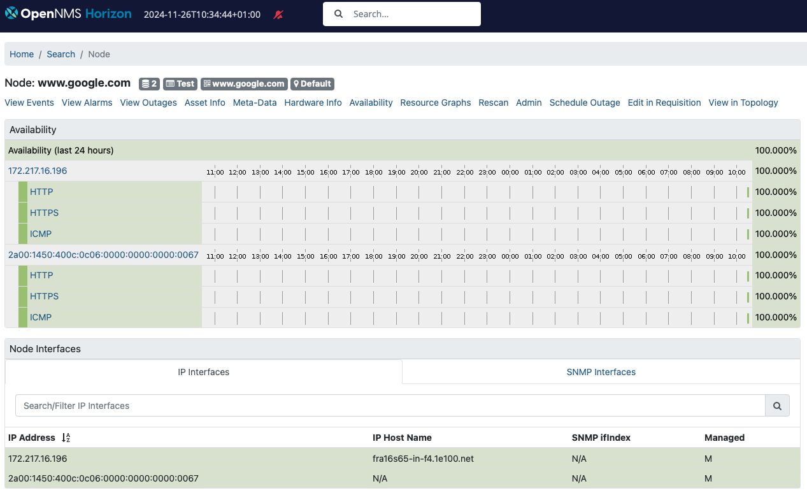
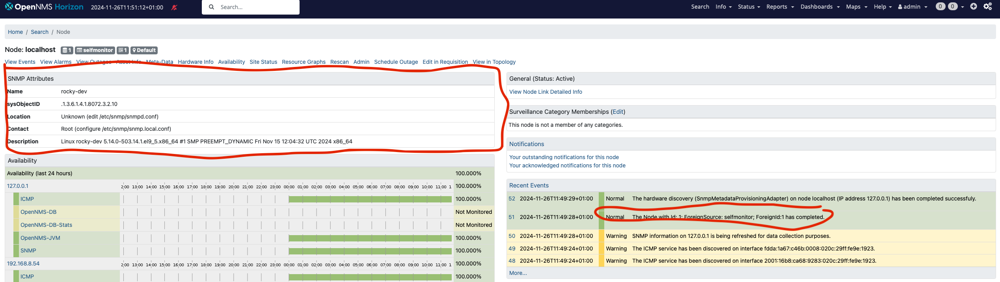
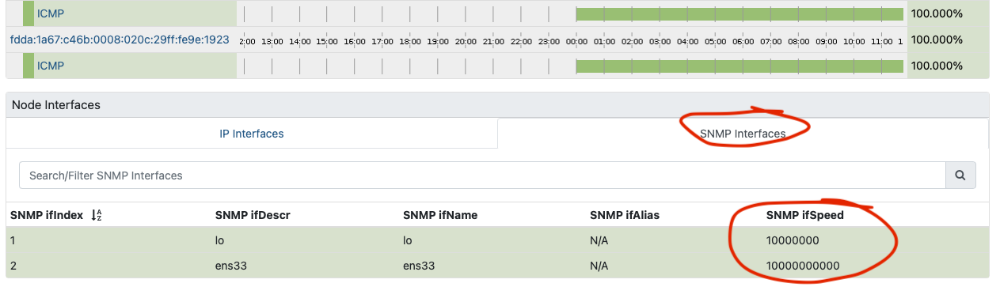

I asked many questions in 2004 on IRC when I tried to get my first OpenNMS instance up and running.
People in the community held my hand when I was struggling.
They helped me to get to my personal "Aha!" moments.
If you have time and patience, this is great, because this is a great learning opportunity.
In the world of User Experience Design, this is called “friction”.
How can you determine friction?
My background is that of someone who cut his hands on sharp metal changing network equipment and operating IT gear for others – I have empathy for people running OpenNMS.
I like to run user empathy sessions with someone in your target group and figure out where and how they struggle.
If you have no one, the next best option is to put yourself in the shoes and get your hands dirty.

I want to document a) what is necessary to build and install OpenNMS Horizon from source on a Rocky 9 minimal server, b) what steps cause people trouble that can serve as an opportunity for improvement, and c) a starting point if you want to learn how to contribute as a software developer.
In this session, we skip all unit, integration and smoke tests and needs to be covered in a dedicated session.

## Requirements

I have installed a Rocky 9 Linux with the software selection “Minimal Install” and selected on the right hand side “Server Standard Tools”.
The hardware specs for this session:

* x86 64bit VM with 4 vCPU’s
* 8GB RAM
* 150 GB hard disk in a large volume mounted to /
* Internet access
* Working directory is the home directory of a user who can do administrative tasks with `sudo` , in this case a user `rocky` in `/home/rocky`

If you want to build a different version here is an overview which OpenJDK you can use for various versions.


## Milestone 1: Build OpenNMS Horizon Snapshot

We build three components:
* OpenNMS Horizon Core (Core) which is the server component with the web user interface
* OpenNMS Horizon Minion (Minion) extending the network visibility to remote networks
* OpenNMS Horizon Sentinel (Sentinel) to distribute persistence workloads

The components can be installed to:

* Core: `/opt/opennms`, specified during the assembly with `-Dopennms.home`
* Minion: `/opt/minion`, specified with `INSTPREFIX` for creating the RPM or Debian packages, default is set to `/opt/minion`
* Sentinel: `/opt/sentinel`, specified with `INSTPREFIX` for creating the RPM or Debian packages, default is set to `/opt/sentinel`

### Step 1: Get the source code and a JDK
Install `git` and the OpenJDK 17 development kit
```bash
sudo dnf -y install git java-17-openjdk-devel
```

Get the source code from GitHub with

```bash
git clone https://github.com/opennms/opennms
```
**💁‍♀️** This will get you automatically the `develop` branch which is the release candidate for the next major version of OpenNMS Horizon.
Our example `34.0.0-SNAPSHOT`.

### Step 2: Compile the source code
Compile the Java source code
```bash
cd opennms
./compile.pl -DskipTests
```

#### Error message:
```bash
[ERROR] File descriptor limit ('ulimit -n') must be >= 20000 but is 1024. Use 'ulimit -n 20000' to set.
```

#### Solution
The default allowing 1024 is not high enough, you can increase the limit in two ways:
* temporary for the user with `ulimit -n 20000`
* permanent by creating a file in `/etc/security/limits.d/99-nofile-limits.conf` with the content `rocky soft nofile 20000`
In case you pick the permanent option, you need to logout and login again to apply these changes.

Rerun the command from step 2.
Depending on your system and the internet bandwidth available, it will take ~25 minutes.

### Step 3: Assemble the components

Assemble the compiled modules so you can deploy it to `/opt/opennms`

```bash
./assemble.pl -DskipTests -Dopennms.home=/opt/opennms
```

This step needs around 3-5 minutes
The build artifacts are the following installable artifacts:

* `./opennms-full-assembly/target/opennms-full-assembly-34.0.0-SNAPSHOT-core.tar.gz`
* `./opennms-full-assembly/target/opennms-full-assembly-34.0.0-SNAPSHOT-optional.tar.gz`
* `./opennms-assemblies/minion/target/org.opennms.assemblies.minion-34.0.0-SNAPSHOT-minion.tar.gz`
* `./opennms-assemblies/sentinel/target/org.opennms.assemblies.sentinel-34.0.0-SNAPSHOT-minion.tar.gz`

The Core server component comes with two tarballs one `-core` and `-optional`.
The `-optional` tarball contains all extensions which need tao be install as a dedicated package, like Alarm Northbounder, DNS provisioning Adapter, SNMP asset adapter etc.
For a tarball deployment you need to manage the Jar files in the lib directory and the configuration files in etc yourself.

### Step 4: Deploy the Core server component.

Create a system account to run the Core application as a non-root user:

```bash
sudo adduser --system opennms --home /opt/opennms
````

Extract the application to `/opt/opennms` and set the owner

```bash
sudo mkdir /opt/opennms
sudo tar -xzf opennms-full-assembly/target/opennms-full-assembly-34.0.0-SNAPSHOT-core.tar.gz -C /opt/opennms
sudo chown opennms:opennms /opt/opennms/ -R
```

Install the system unit and try to start it:

```bash
sudo cp /opt/opennms/etc/opennms.service /etc/systemd/system
sudo systemctl daemon-reload
sudo systemctl start opennms.service
```

#### Error message

```bash
sudo systemctl start opennms.service
Job for opennms.service failed because the control process exited with error code.
See "systemctl status opennms.service" and "journalctl -xeu opennms.service" for details.
```

We see more details with `journalctl -u opennms.service`:
```bash
Nov 25 22:55:22 rocky-dev systemd[1]: Failed to start OpenNMS server.
Nov 25 22:57:42 rocky-dev systemd[1]: Starting OpenNMS server...
Nov 25 22:57:42 rocky-dev opennms[40195]: Starting OpenNMS:
Nov 25 22:57:42 rocky-dev opennms[40280]: /opt/opennms/bin/opennms: OpenNMS not configured.
Nov 25 22:57:42 rocky-dev opennms[40280]: /opt/opennms/etc/configured does not exist.
Nov 25 22:57:42 rocky-dev opennms[40280]: You need to run the installer to set up the database.  In most
Nov 25 22:57:42 rocky-dev opennms[40280]: cases, it is enough to run:
Nov 25 22:57:42 rocky-dev opennms[40280]:   /opt/opennms/bin/install -dis
Nov 25 22:57:42 rocky-dev opennms[40280]: For details, see the install guide at:
Nov 25 22:57:42 rocky-dev opennms[40280]: http://www.opennms.org/index.php/QuickStart#Initialize_OpenNMS_and_the_Database
Nov 25 22:57:42 rocky-dev opennms[40195]: failed
Nov 25 22:57:42 rocky-dev systemd[1]: opennms.service: Control process exited, code=exited, status=1/FAILURE
Nov 25 22:57:42 rocky-dev systemd[1]: opennms.service: Failed with result 'exit-code'.
Nov 25 22:57:42 rocky-dev systemd[1]: Failed to start OpenNMS server
```

We have no PostgreSQL database.

### Step 5: Install PostgreSQL 15

At this point in time, PostgreSQL 15 is latest version supported with OpenNMS Horizon.

Install from the official PostgreSQL repository
```bash
sudo dnf -y install https://download.postgresql.org/pub/repos/yum/reporpms/EL-9-x86_64/pgdg-redhat-repo-latest.noarch.rpm
sudo dnf install -y postgresql15-server
````

When you try to start PostgreSQL with
```bash
sudo systemctl enable --now postgresql-15.service
```

You will get the following error message:

```bash
Created symlink /etc/systemd/system/multi-user.target.wants/postgresql-15.service → /usr/lib/systemd/system/postgresql-15.service.
Job for postgresql-15.service failed because the control process exited with error code.
See "systemctl status postgresql-15.service" and "journalctl -xeu postgresql-15.service" for details.
```

The detailed log

```bash
journalctl -u postgresql-15.service
```

```bash
Nov 25 23:22:26 rocky-dev systemd[1]: Starting PostgreSQL 15 database server...
Nov 25 23:22:26 rocky-dev postgresql-15-check-db-dir[40806]: "/var/lib/pgsql/15/data/" is missing or empty.
Nov 25 23:22:26 rocky-dev postgresql-15-check-db-dir[40806]: Use "/usr/pgsql-15/bin/postgresql-15-setup initdb" to initialize the database cluster.
Nov 25 23:22:26 rocky-dev postgresql-15-check-db-dir[40806]: See /usr/share/doc/postgresql15/README.rpm-dist for more information.
Nov 25 23:22:26 rocky-dev systemd[1]: postgresql-15.service: Control process exited, code=exited, status=1/FAILURE
Nov 25 23:22:26 rocky-dev systemd[1]: postgresql-15.service: Failed with result 'exit-code'.
Nov 25 23:22:26 rocky-dev systemd[1]: Failed to start PostgreSQL 15 database server.
```

We need to initialize the database directory first with

```bash
sudo postgresql-15-setup initdb
```

Restart the PostgreSQL database with `sudo systemctl enable --now postgresql-15.service`.

```bash
ss -lnpt sport = :5432
```
The database should now be running an listening on 5432 on the IPv4 and IPv6 loopback address.

```bash
State                   Recv-Q                  Send-Q                                   Local Address:Port                                   Peer Address:Port                 Process
LISTEN                  0                       244                                          127.0.0.1:5432                                        0.0.0.0:*
LISTEN                  0                       244                                              [::1]:5432                                           [::]:*
```

### Step 6: Create a database and a user

```bash
sudo -i -u postgres createuser -P my-hzn-user
```

Set a secure password, in this example I use `my-hzn-user-pass` as a password to describe these steps.

Create a database and set the owner accordingly
```bash
sudo -i -u postgres createdb -O my-hzn-user my-hzn-db
```

Set a secure password for the `postgres` user.
```bash
sudo -i -u postgres psql -c "ALTER USER postgres WITH PASSWORD 'my-postgres-pass';"
```

Create a secure vault and add the database credentials in OpenNMS Horizon

```bash
sudo -u opennms /opt/opennms/bin/scvcli set postgres my-hzn-user my-hzn-user-pass
sudo -u opennms /opt/opennms/bin/scvcli set postgres-admin postgres my-postgres-pass
```

The key syntax from the scvcli set command:

The literal `postgres` is a reference name for the credential set for the user `my-hzn-user` with the password `my-hzn-user-pass`.

Configure the database connection in OpenNMS Horizon Core

```
sudo vi /opt/opennms/etc/opennms-datasources.xml
```

You set an reference alias for the credentials.
The alias `postgres` is used for the Core database and `postgres-admin` for monitoring and schema update purposes.
Set the database name in `database-name` and in the `url` accordingly.
```xml
<jdbc-data-source name="opennms"
                    database-name="my-hzn-db"
                    class-name="org.postgresql.Driver"
                    url="jdbc:postgresql://localhost:5432/my-hzn-db"
                    user-name="${scv:postgres:username|opennms}"
                    password="${scv:postgres:password|opennms}" />

<jdbc-data-source name="opennms-admin"
                  database-name="template1"
                  class-name="org.postgresql.Driver"
                  url="jdbc:postgresql://localhost:5432/template1"
                  user-name="${scv:postgres-admin:username|postgres}"
                  password="${scv:postgres-admin:password|}">
  <connection-pool idleTimeout="600"
                   minPool="0"
                   maxPool="10"
                   maxSize="50" />
</jdbc-data-source>
<jdbc-data-source name="opennms-monitor"
                    database-name="postgres"
                    class-name="org.postgresql.Driver"
                    url="jdbc:postgresql://localhost:5432/postgres"
                    user-name="${scv:postgres-admin:username|postgres}"
                    password="${scv:postgres-admin:password|}">
    <connection-pool idleTimeout="600"
                     minPool="0"
                     maxPool="10"
                     maxSize="50" />
</jdbc-data-source>
```

### Step 7: Initialize the database schema

```bash
sudo -u opennms /opt/opennms/bin/install -dis
```

#### Error message

```
runjava: Error: /opt/opennms/etc/java.conf file not found.
runjava: Run "/opt/opennms/bin/runjava -s" to set up the java.conf file.
runjava:
runjava: You can install a JVM by downloading one from Oracle, or by running something like
runjava: 'apt-get install openjdk-11-jdk' or 'yum install java-11-openjdk-devel'.
```

#### Solution: Configure a JDK

```bash
sudo -u opennms /opt/opennms/bin/runjava -s
```
The runjava binary tries to find the most reasonable JDK installation on your system.
It will be written into the `/opt/opennms/etc/java.conf`.
The `-s` searches for a suitable JDK.
If you want to use a specific JDK you can set it with

```bash
/opt/opennms/bin/runjava -S /path/to/jdk`
```

Re-run the command from step 7 again.

Start OpenNMS Horizon core and enable it on system startup with

```bash
sudo systemctl enable --now opennms
```

#### Error: Can't connect to the web user interface
Verify if the web application is running on port 8980/tcp

```bash
ss -lnpt sport = :8980
```

Firewalld is running by default and is blocking 8980/tcp access to the web user interface.
You can allow the connction with

```bash
sudo firewall-cmd --permanent --add-port=8980/tcp
sudo systemctl reload firewalld
```

You should now be able to login to the webapplication by going to http://your-server-ip:8980.
Set a secure admin password.

### Step 8: Monitor a node

Let's add a node for monitoring.
Create a requisition "Test" and add a Node you can ping.
In my example, I used www.google.com with an IPv4 and an IPv6 address like in the screenshot below.



I have assigned ICMP and set both SNMP interfaces as "Not Eligible" and hit synchronize for the requisition.
With the built-in default detectors you get HTTP and HTTPS detected as well and the node page should look like this:



### Step 9: Simulate an outage

Simulate an outage with the given node setting a blackhole route with

```bash
sudo ip route add blackhole 172.217.16.196/32
```

The interface with the IPv4 address should be down and the node should still be reachable via the IPv6 interface.
You can do the same thing with the IPv6 interface.

### Step 10: Install and configure SNMP

Let's add Net-SNMP and monitor the system and see what happens.

```bash
sudo dnf install net-snmp net-snmp-utils
```

For simplicity we give the public community read access to the whole subtree .1 by adding this line:

```bash
view    systemview    included   .1
````

in the `/etc/snmp/snmpd.conf`.
Enable and start the SNMP daemon with
```bash
sudo systemctl enable --now snmpd
```

You should be able to get access to the SNMP agent with

```bash
snmpwalk -v 2c -c public localhost
```

### Step 11: Rescan the Horizon Core server

Update the server in your monitoring inventory.
Go to the node "localhost" and click the "Rescan" button for that particular node.
You should get now the SNMP attributes filled from your SNMP agent.



You should see also additional IP addresses assigned to the node including the SNMP interfaces.



## Summary

As you can see we have now a functional OpenNMS Horizon Core instance build and deployed from the source code repository.
If you are familiar with OpenNMS you might now wonder what about RRDTool, JNI ICMP (jicmp/jicmp6) and IPLIKE?

### JRobin

As with the steps described here, the Core system uses the built-in Java based JRobin time series storage implementation.
It is compatible with RRDTool 1.0 but lacks newer RRDTool functionalities.
The RRD files are created as JRB files.

**☣️ Important:** JRobin is a working solution but nothing you want to rely on in a production environment.
It is highly recommended to migrate at least to a maintained RRDTool version.

### JNA ICMP demystified

For ICMP the JNA implementation is used.
In the `manager.log` you will see on startup an algorithm to determine the best available ICMP implementation:

```bash
2024-11-25 23:59:15,882 INFO  [Main] o.o.n.i.b.BestMatchPingerFactory: Searching for best available pinger...
2024-11-25 23:59:15,904 INFO  [Main] o.o.n.i.b.BestMatchPingerFactory: Found pinger class org.opennms.netmgt.icmp.jni.JniPinger, but it was unable to ping localhost: no jicmp in java.library.path: :/opt/opennms/lib:/opt/opennms/lib/linux64:/usr/java/packages/lib:/usr/lib64:/lib64:/lib:/usr/lib
2024-11-25 23:59:15,904 INFO  [Main] o.o.n.i.b.BestMatchPingerFactory: Found pinger class org.opennms.netmgt.icmp.jni.JniPinger, but it was unable to ping localhost: no jicmp in java.library.path: :/opt/opennms/lib:/opt/opennms/lib/linux64:/usr/java/packages/lib:/usr/lib64:/lib64:/lib:/usr/lib
2024-11-25 23:59:15,905 INFO  [Main] o.o.n.i.b.BestMatchPingerFactory: Found pinger class org.opennms.netmgt.icmp.jni.JniPinger, but it was unable to ping localhost: no jicmp in java.library.path: :/opt/opennms/lib:/opt/opennms/lib/linux64:/usr/java/packages/lib:/usr/lib64:/lib64:/lib:/usr/lib
2024-11-25 23:59:15,908 INFO  [Main] o.o.n.i.b.BestMatchPingerFactory: Found pinger class org.opennms.netmgt.icmp.jni6.Jni6Pinger, but it was unable to ping localhost: no jicmp in java.library.path: :/opt/opennms/lib:/opt/opennms/lib/linux64:/usr/java/packages/lib:/usr/lib64:/lib64:/lib:/usr/lib
2024-11-25 23:59:15,908 INFO  [Main] o.o.n.i.b.BestMatchPingerFactory: Found pinger class org.opennms.netmgt.icmp.jni6.Jni6Pinger, but it was unable to ping localhost: no jicmp in java.library.path: :/opt/opennms/lib:/opt/opennms/lib/linux64:/usr/java/packages/lib:/usr/lib64:/lib64:/lib:/usr/lib
2024-11-25 23:59:15,909 INFO  [Main] o.o.n.i.b.BestMatchPingerFactory: Found pinger class org.opennms.netmgt.icmp.jni6.Jni6Pinger, but it was unable to ping localhost: no jicmp6 in java.library.path: :/opt/opennms/lib:/opt/opennms/lib/linux64:/usr/java/packages/lib:/usr/lib64:/lib64:/lib:/usr/lib
2024-11-25 23:59:15,914 DEBUG [Main] o.o.j.j.NativeDatagramSocket: org.opennms.jicmp.jna.UnixV4NativeSocket(2, 1, 16142)
2024-11-25 23:59:15,958 DEBUG [Main] o.o.j.j.NativeDatagramSocket: Failed to create class org.opennms.jicmp.jna.UnixV4NativeSocket SOCK_DGRAM socket (null).  Trying with SOCK_RAW.
2024-11-25 23:59:15,959 DEBUG [Main] o.o.j.j.NativeDatagramSocket: org.opennms.jicmp.jna.UnixV6NativeSocket(10, 58, 16142)
2024-11-25 23:59:15,962 DEBUG [Main] o.o.j.j.NativeDatagramSocket: Failed to create class org.opennms.jicmp.jna.UnixV6NativeSocket SOCK_DGRAM socket (null).  Trying with SOCK_RAW.
2024-11-25 23:59:15,978 DEBUG [Main] o.o.n.i.j.JnaPingRequest: 1732575555978: Sending Ping Request: [ID=JnaPingRequestId[addr = /127.0.0.1, ident = 16142, seqNum = 1, tId = 1],Retries=0,Timeout=500,Packet-Size=64,Expiration=-1,Callback=org.opennms.netmgt.icmp.LogPrefixPreservingPingResponseCallback@389c2404]
2024-11-25 23:59:15,980 DEBUG [Main] o.o.c.t.RequestTracker: Scheduling timeout for request to [ID=JnaPingRequestId[addr = /127.0.0.1, ident = 16142, seqNum = 1, tId = 1],Retries=0,Timeout=500,Packet-Size=64,Expiration=1732575556478,Callback=org.opennms.netmgt.icmp.LogPrefixPreservingPingResponseCallback@389c2404] in 498 ms
2024-11-25 23:59:15,981 INFO  [Main] o.o.n.i.SinglePingResponseCallback: waiting for ping to /127.0.0.1 to finish
2024-11-25 23:59:15,991 INFO  [JNA-ICMP-16142-Callback-Processor] o.o.n.i.SinglePingResponseCallback: got response for address /127.0.0.1, thread 16142, seq 1 with a responseTime 2.403614ms
2024-11-25 23:59:15,992 INFO  [Main] o.o.n.i.SinglePingResponseCallback: finished waiting for ping to /127.0.0.1 to finish
2024-11-25 23:59:15,992 INFO  [Main] o.o.n.i.b.BestMatchPingerFactory: Best available pinger is: class org.opennms.netmgt.icmp.jna.JnaPinger
2024-11-25 23:59:15,992 DEBUG [Main] o.o.j.j.NativeDatagramSocket: org.opennms.jicmp.jna.UnixV4NativeSocket(2, 1, 771)
2024-11-25 23:59:15,992 DEBUG [Main] o.o.j.j.NativeDatagramSocket: Failed to create class org.opennms.jicmp.jna.UnixV4NativeSocket SOCK_DGRAM socket (null).  Trying with SOCK_RAW.
2024-11-25 23:59:15,993 DEBUG [Main] o.o.j.j.NativeDatagramSocket: org.opennms.jicmp.jna.UnixV6NativeSocket(10, 58, 771)
2024-11-25 23:59:15,993 DEBUG [Main] o.o.j.j.NativeDatagramSocket: Failed to create class org.opennms.jicmp.jna.UnixV6NativeSocket SOCK_DGRAM socket (null).  Trying with SOCK_RAW.
2024-11-25 23:59:15,995 INFO  [Main] o.o.n.v.Manager: Using ICMP implementation: org.opennms.netmgt.icmp.best.BestMatchPinger
2024-11-25 23:59:15,995 INFO  [Main] o.o.n.v.Manager: IPv4 ICMP available? true
2024-11-25 23:59:15,995 INFO  [Main] o.o.n.v.Manager: IPv6 ICMP available? true
```

By default in your `log4j2.xml` the daemons are set to log level `DEBUG`.
You can see what Pollerd is using for ICMP in log entries like this one:

```bash
2024-11-26 12:05:52,960 DEBUG [pool-20-thread-146] o.o.n.i.j.JnaPingRequest: 1732619152960: Sending Ping Request: [ID=JnaPingRequestId[addr = /172.217.16.196, ident = 29237, seqNum = 1, tId = 235],Retries=2,Timeout=3000,Packet-Size=64,Expiration=-1,Callback=org.opennms.netmgt.icmp.LogPrefixPreservingPingResponseCallb
ack@351c06ec]
2024-11-26 12:05:52,960 DEBUG [pool-20-thread-146] o.o.c.t.RequestTracker: Scheduling timeout for request to [ID=JnaPingRequestId[addr = /172.217.16.196, ident = 29237, seqNum = 1, tId = 235],Retries=2,Timeout=3000,Packet-Size=64,Expiration=1732619155960,Callback=org.opennms.netmgt.icmp.LogPrefixPreservingPingResponseCallback@351c06ec] in 3000 ms
```

**☣️ Important:** The ICMP implementation using JNA is a working solution if performance doesn't matter.
If you have a very large set of IP addresses you want to ping and response time accuracy matters, you want the JNI implementation for ICMP.

> The calling overhead for a single native call using JNA interface mapping can be an order of magnitude (~10X) greater time than equivalent custom JNI (whether it actually does in the context of your application is a different question). In raw terms, the calling overhead is on the order of hundreds of microseconds instead of tens of microseconds.\
> – [FAQ JNA](https://github.com/java-native-access/jna/blob/master/www/FrequentlyAskedQuestions.md#how-does-jna-performance-compare-to-custom-jni)

### IPLIKE stored procedure

The stored procedure IPLIKE is written as a C-based stored procedure and used to optimize complex IP address queries within PostgreSQL.
It should offers better performance in terms of less latency withing the OpenNMS Core application.
You need a lot of IP query workload to leverage from this function.
It is nevertheless a required dependency in our Debian and RPM packages.
Covering this topic specifically is worth investigating in a dedicated article.

## What can we do next?

There are now additional steps we can take from here, most notably:

* [JNA vs. JNI ICMP performance implications]()
* [Compile and install IPLIKE stored procedure in PostgreSQL]()
* Compile and install RRDTool support using JRRD2
* Building Core, Minion, and Sentinel RPM packages
* Create Docker container images

Stay tuned and so long
