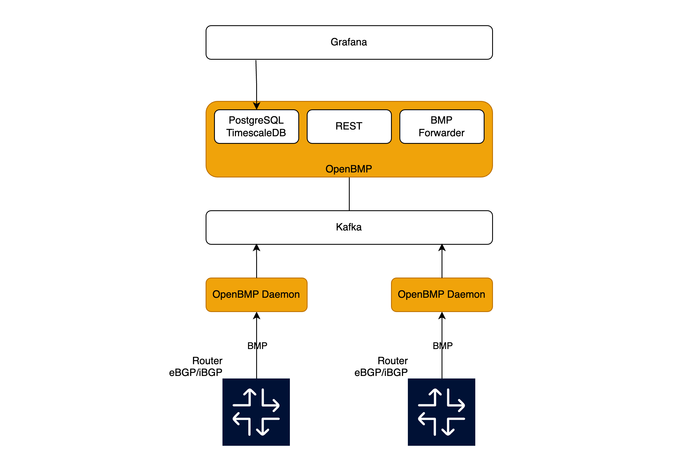

We have seen people in the OpenNMS chat who started playing with the BGP monitoring protocol.
I had some notes in our MediaWiki which doesn't exist anymore.
To provide some background I've resurrected my notes and republished the content.
I had to tweak a few places to make it a bit more current.
During the 5 years, OpenNMS has fixed bugs and maintained the functionality.
The main intention of resurrecting the article is to give people some insights and background on what approach was chosen and why things are as they are today.

The increasing importance of BGP as the vendor-agnostic and open control plane for network communication requires specific monitoring capabilities.
Monitoring BGP with SNMP was ok, but keeping up on how BGP is used, e.g. IPv4, and IPv6 in data center fabrics, the SNMP implementation lacked features and a standardized vendor-agnostic solution.
To get a real-time, deep vendor-agnostic, and scalable solution, the BMP protocol was introduced.
A key technical difference between BMP and SNMP is the way how BGP metrics and state information are transferred.
Instead of polling for states and metrics, the BMP agent on the router connects via a TCP connection to the monitoring system and sends state changes and metrics to the monitoring system.
The developer of the protocol provided an open end-to-end reference implementation in [OpenBMP](https://www.openbmp.org/).
The work in the OpenBMP project helped us understand how we can adopt the protocol in OpenNMS.

We came across users and customers sponsoring features in OpenNMS who wanted to see functionality in OpenNMS.
A small team with mixed skills formed around this topic.
I had a lot of empathy with my networking background and found this topic interesting. I tried to help set it up and provide some infrastructure for validation and testing.

The most functional work you see today in OpenNMS was done in a one-week hackathon in Ludwigsburg in an Airbnb in February 2020.
We had some help from the community working in the telco space who sent us a BGP full feed which we sent into GoBGP as a playground.
Kudos to Andreas Schäfer working as a Senior Network Engineer at NETHINKS who helped us with this.

Because of the streaming telemetry nature, this feature was implemented as part of OpenNMS Telemetryd.
We have looked at the reference implementation specifically at the orange components from the diagram below.

At a high level, we considered OpenBMP components as closed boxes and tried to address the challenge by dividing it into three milestones.

## Milestone 1: OpenBMP Daemon
Get the BMP TCP listener and the protocol parser into OpenNMS Telemetry Daemon.
Forward metrics and an example for state messages to Kafka and make sure the OpenBMP server component can consume and process the data OpenNMS creates in the same way.
As a reference implementation for a BMP state monitoring event, we decided to use a peer up/down event.
A peer down should raise and a peer up should clear a corresponding alarm in OpenNMS.
Metrics and states should be persisted in the same way so you can use the existing Grafana dashboards against the PostgreSQL database.
Having a playground to evaluate the functionality easily which was the driver for the [BGP monitoring playground]().

## Milestone 2: OpenBMP application
Implement the functionality of the OpenBMP application in OpenNMS Telemetryd to consume the BMP data from Kafka.
The persistence should be in the same way, so you can just use the existing Grafana dashboards as you would use for OpenBMP.
By writing the code in our OSGi framework you can run the code persisting performance metrics [distributed on Sentinels](https://docs.opennms.com/horizon/33/reference/telemetryd/protocols/bmp/persisting-adapter.html#run-bmp-sentinel).

## Milestone 3: Metrics to the OpenNMS time series framework
Instead of using the opinionated schema for time series and state information from OpenBMP, the time series needs to be handled from OpenNMS internally in the same way as any other time series data.
The metrics persistence into NewTS should be working from the Core system as well as with Sentinels.
Rework the Grafana dashboards so they can work with the OpenNMS time series format and the inventory data.

## Summary
What we have today (Horizon 33.x / Meridian 2024.x) is the implementation until Milestone 2.
To associate BMP messages to a Node in the OpenNMS inventory the source IP address of the BMP message is used.
We had to relax this constraint and added a meta field (`metaDataNodeLookup`) on a Node with the BGP ID to associate a message to a Node instead of the source IP address.

There are two adapters available:
* [BMP Telemetry Adapter](https://docs.opennms.com/horizon/33/reference/telemetryd/protocols/bmp/adapter.html): handling metrics persisted as time series data
* [BMP Peer Status Adapter](https://docs.opennms.com/horizon/33/reference/telemetryd/protocols/bmp/peer-status.html): handling the BGP peer state messages and create a peer up/down alarm workflow

We have kept the OpenBMP integration in the code base which allows you to integrate with [OpenBMP](https://docs.opennms.com/horizon/33/reference/telemetryd/protocols/bmp/integration-adapter.html) via Kafka.

☢️ Those features were introduced somewhere around 2020.
A lot of things moved along in the last 5 years.
If you use it, you will probably run into roadblocks.
Please [report issues](https://issues.opennms.com) which indicates interest in that functionality.

## Some reasonable next steps

The feature isn't fully implemented, from my point of view the following topics need to be addressed:

* Add a monitor if the communication to the BMP agent isn't working
* Store the performance metrics in an OpenNMS native performance metrics, to remove the requirement to have TimescaleDB for persistence
* Creating time series visualization natively in OpenNMS and with Grafana using the state and performance metrics from OpenNMS natively

## Documented issues

* [Determine completeness of the feature](https://opennms.atlassian.net/browse/NMS-13054)
* [Support 32-bit AS numbers](https://opennms.atlassian.net/browse/NMS-13741)

## References and Credits
* Ulf, just doing the fun parts :)
* Jesse White, Dustin Frisch, Christian Pape, Markus von Rüden, Chandra Gorantla for the hard work
* Andreas Schäfer at NETHINKS for helping us with real-world BGP data
* Tarus Balog and David Hustace providing the space, time, and money to hack along :)

## Some moments of Ulf during the week

... and yes we got sometimes derailed :)

