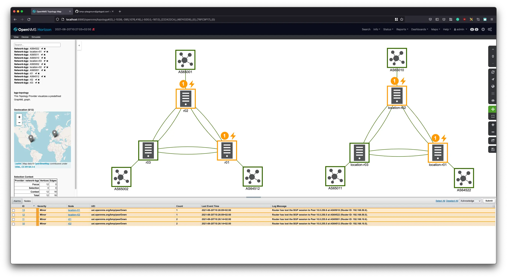

Monitoring BGP can be done in various ways.
First thing people want to know is if there is a way to get notifications in case a BGP peering session goes down.
A pretty common way monitoring the BGP peering session state is using SNMP and the RFC1269 MIB.
In OpenNMS Horizon we have the [BGP session monitor](https://docs.opennms.com/horizon/29.0.1/operation/service-assurance/monitors/BgpSessionMonitor.html) which allows to track the state using the BGP peer table.
The downside is, you need to configure for every peering session a monitor and this can be cumbersome and hard to maintain.

Since OpenNMS Horizon 27 has implemented the BGP Monitoring Protocol (BMP) to achieve more advanced methods to monitor BGP deployments.
Instead of polling every few minutes to track the BGP peer session state, the router connects to a BMP collector and sends statistics and state changes as messages.
In OpenNMS Horizon the Telemetryd can be configured to act as a BMP collector.

You get immediately an alarm as soon the BGP peer down message is received.
The alarm shows you information about the peer and which AS is affected.
Of course there is a catch, your router needs to implement BMP to leverage from these features.

To configure Telemetryd on Horizon core server you need at minimum the following configuration in `${OPENNMS_HOME}/etc/telemetryd-configuration.xml`:

```xml
<?xml version="1.0"?>
<telemetryd-config>
  <listener name="BMP-11019" class-name="org.opennms.netmgt.telemetry.listeners.TcpListener" enabled="true">
    <parameter key="port" value="11019"/>
    <parser name="BMP-Parser" class-name="org.opennms.netmgt.telemetry.protocols.bmp.parser.BmpParser" queue="BMP" />
  </listener>
  <queue name="BMP">
    <adapter name="BMP-Telemetry-Adapter" class-name="org.opennms.netmgt.telemetry.protocols.bmp.adapter.BmpTelemetryAdapter" enabled="true">
      <package name="BMP-Default">
        <rrd step="300">
          <rra>RRA:AVERAGE:0.5:1:2016</rra>
          <rra>RRA:AVERAGE:0.5:12:1488</rra>
          <rra>RRA:AVERAGE:0.5:288:366</rra>
          <rra>RRA:MAX:0.5:288:366</rra>
          <rra>RRA:MIN:0.5:288:366</rra>
        </rrd>
      </package>
    </adapter>
    <adapter name="BMP-PeerStatus-Adapter" class-name="org.opennms.netmgt.telemetry.protocols.bmp.adapter.BmpPeerStatusAdapter" enabled="true">
    </adapter>
  </queue>
</telemetryd-config>
````

It will run a TCP listener on port 11019 and assigns the BMP telemetry parser to this listener.
To process messages about BGP peer state changes the BMP-PeerStatus-Adapter needs to be enabled.

If you want to use a Minion as BMP collector you can configure a BMP TCP listener and parser by creating a file in `${MINION_HOME}/etc/org.opennms.features.telemetry.listeners-bmp-11019.cfg` with the following content:

```
name = BMP
class-name = org.opennms.netmgt.telemetry.listeners.TcpListener
parameters.port = 11019
parsers.0.name = BMP
parsers.0.class-name = org.opennms.netmgt.telemetry.protocols.bmp.parser.BmpParser
```

In my playground I've used GoBGP as BGP implementation which supports BMP.
The address is your BMP collector endpoint for BMP state and statistic messages.

```toml
[[bmp-servers]]
    [bmp-servers.config]
        address = "192.168.50.4"
        port = 11019
        route-monitoring-policy = "pre-policy"
        statistics-timeout = 3600
```

The IP address 192.168.50.4 in this case is the IP address of my Horizon core instance where Telemetryd is running.
If you have a Minion in the network you should use the Minions IP address instead.

If you want to play around with the environment, I've created a [BMP Playground](https://github.com/opennms-forge/bmp-playground) which has all components and a little BGP network to play with.


The playground has 6 BGP routers, 3 running in the same network as the Horizon core server instance and 3 are in a remote network using our Minion as a BMP collector.

When you have all up and running, just run the `setup/provision.sh` script.
It will add the nodes and creates a custom BGP and IP network topology.

You can disable or enable a BGP peer session of a router in a remote location with the docker command

```shell
docker-compose exec location-r01 gobgp neighbor 10.0.250.6 disable/enable
```

The BGP session is shutdown, and you should get two corresponding alarms which look like this:


The status is also reflected in the BGP and IP topology as shown below.




When you enable the neighbor again, the peering session is restored the alarm is cleared accordingly.

So long and thank you for all the fish ...
