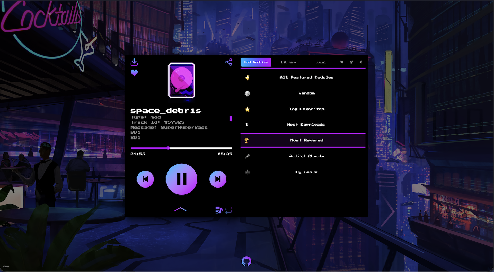

I've been a quiet user of [CoolModFiles.com](https://CoolModFiles.com) for years.
It's a tiny web player that grabs a random MOD file from [modarchive.org](https://modarchive.org) and plays it.
No login, no library, no algorithm — just a play button and a wave of nostalgia from the Amiga and PC tracker scene.
The README says "no black magic involved" and that's exactly the appeal: a digital amplifier for a corner of the demoscene most people never knew existed.

The thing is, after the hundredth random track, I started wanting agency.
Sometimes I wanted to browse Most Downloads.
Sometimes I wanted a specific artist's back catalogue.
Sometimes I wanted to point it at my own mod collection on a server and play it through the same beautiful UI.
I had an itch.

So I spent a chunk of my private Claude AI budget on a fork.
Opus 4.7 and I worked through it over a couple of weeks of evenings.
The patches are now in [no42-org/CoolModFiles](https://github.com/no42-org/CoolModFiles), and the easiest way to describe them is in three layers.

*Before the patches, the confession: I did this because I love this tool.*
*Spending personal Claude tokens on a niche tracker-music player is not a high-ROI activity.*
*That is precisely the point.*

Here is how it looks like now.



## Layer 1: modernize the stack

Before adding anything, I wanted to stand on something solid.
The original codebase was JavaScript with `allowJs: true`.
Over a series of phases I migrated it to TypeScript, ending with `strict: true` and `allowJs: false`.
Hooks, utilities, the icon components, the player's imperative API, every route — typed end to end.

The migration caught at least two latent bugs along the way: a dead `newestOnTop` toast option that `react-toastify` had been silently ignoring for years, and a closure-capture in `useKeyPress` where `targetKey` was captured on the first render and never rebound when the prop changed.
The kind of thing TypeScript exists to surface.

Then `next.config.js` became `next.config.ts`, finishing the JS → TS conversion across the entire source tree.

## Layer 2: redesign the source picker

The original UI had three top-row tabs (Random, Library, Local) and switching to "Random" played a new track immediately — a coupling that fought you whenever you wanted to just look around without committing.

I moved everything into a right-side drawer.
One launcher (the `≡` button on the player face), five tabs (Mod Archive, Library, Local, Favorites, Help), no surprise playback on tab switches.
The drawer is responsive: below 1440px viewports it overlays the player; at 1440px and up it slides into the right half of an expanded wrapper and the whole combo re-centres so the player doesn't drift off-axis.

A small `VersionLabel` now lives in the bottom-left corner — `git describe --tags --abbrev=0` baked in at build time, with an env-var fallback for Dockerized builds where `.git` isn't present.
Tiny detail, but it's the kind of thing that makes self-hosting feel like a real release rather than a `:latest` shrug.

## Layer 3: actually browse Mod Archive

This is the part I really wanted.
The drawer's old "Random" tab became "Mod Archive" — a drill-in menu instead of a single button:

- 🎲 **Random** — the original behaviour, still one click away
- 🌟 **All Featured Modules** — paginated
- ⭐ **Top Favorites** — scraped from `view_top_favourites`
- ⬇ **Most Downloads** — `view_chart&query=tophits`
- 🏆 **Most Revered** — `view_chart&query=topscore`
- 🎤 **Artist Charts** — drills into an artist's full upload list
- 🎼 **By Genre** — grouped index of categories (Alternative, Electronica, …); tap a genre to see its mods

Everything is paginated (Prev / page X of Y / Next), everything is cached for 24 hours in a module-level in-memory cache shared across the app's request handlers, and the upstream scraper has a distinct User-Agent and no retries — politeness matters when you're piggybacking on someone else's hosting bill.
The `n` hotkey is chart-aware: it walks the visible page of whichever chart you picked from, with modulo loop at the end.

And because Mod Archive isn't the only place mod files live, there's a proper Library mode.
Set `LIBRARY_ROOT` in the container env, mount your collection at `/library:ro`, and the Library tab appears in the drawer with search, browse, pagination, playback.
A small `scripts/test-library-security.sh` exercises path traversal protection and the extension allowlist; the `:ro` mount flag is defense-in-depth on top of a read-only API.

Browsing someone else's archive is half the joy.
The other half is pointing the same player at your own dusty crate of `.mod` files — which is where self-hosting earns its keep.

## Self-hosting

There's a `compose.yml` in the repo that pulls the published multi-arch GHCR image and wires up Library mode with a read-only `./mods` volume:

```yaml
services:
  coolmodfiles:
    image: ghcr.io/no42-org/coolmodfiles:latest
    ports:
      - "3000:3000"
    environment:
      LIBRARY_ROOT: /library
      DOMAIN: https://your.domain
    volumes:
      - ./mods:/library:ro
```

```bash
docker compose up -d
```

Drop your mods in `./mods`, point your browser at `:3000`, and you've got a private CoolModFiles on your own box with your own collection alongside Mod Archive's catalogue.
`MOD`, `XM`, `S3M`, `IT`, `MPTM` — anything `libopenmpt` can decode.
The `:ro` mount is load-bearing — the app's API is read-only by design, but the kernel-level mount flag means a bug can't accidentally write back to your archive.

None of this fork exists without the original.
[@orhun](https://github.com/orhun), [@wkfo](https://github.com/wkfo) and [@bufgix](https://github.com/bufgix) built the player I've spent years pressing play on.
The patches in `no42-org/CoolModFiles` are additive — every chart, every drill-in, every typed prop sits on top of their work.
If you self-host this, you're self-hosting their craft as much as mine.

## Why bother

The honest answer: because I wanted to.
Spending personal Claude tokens on a fork of a niche tracker-music player is not a high-ROI activity if you measure it that way.
But I love this tool.
I love that someone built it.
I love that modarchive.org exists.
I love that you can still, in 2026, write a few thousand lines of TypeScript and meaningfully extend a piece of demoscene infrastructure without anyone asking for an OKR.

The patches are public.
The Docker image is on GHCR.
The README has the recipes.
If you're an Amiga fan, a tracker-music nerd, or just curious what those four-letter file extensions sound like, clone it, host it, play with it.

Happy hacking.
