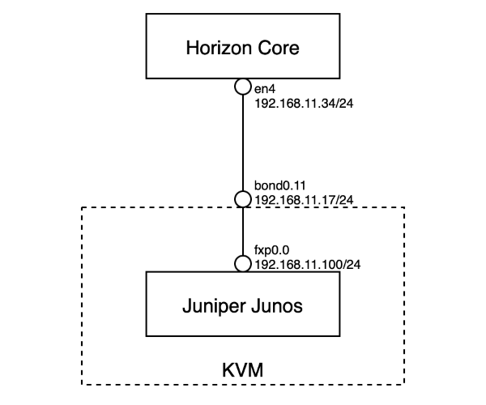
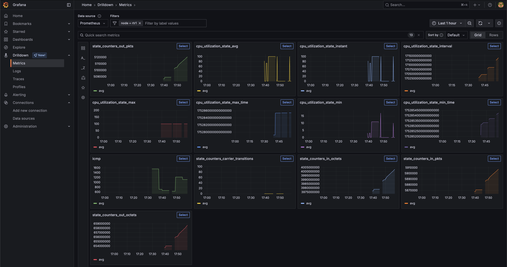

This document describes how you can set up a lab environment for testing gNMI using a virtual HPE Juniper router running Junos 24.2 R1-S2.5.
It shows how you can collect metrics for interfaces and CPU utilization collected with OpenNMS.
This isn't something I do every day, so I just preserve this here for my future self and the ones who want to get up to speed a bit quicker.

## What you will learn
* Enable gNMI over gRPC with sensors on a HPE Juniper router
* Verify the gRPC connections and configuration
* Enable OpenNMS Horizon to subscribe to gRPC streams for sensor data
* Set up TLS on gRPC using a self-signed certificate authority
* Visualize the collected data in Grafana

## Limitations

* Streaming telemetry can only be configured from the OpenNMS Core instance, see enhancement [NMS-18064](https://opennms.atlassian.net/browse/NMS-18064)
* Metric labels for network interfaces are right now just resource id strings

## Before you begin

You need the following environment to get a lab running:

* System with at least 2 CPU and 8 GB RAM with virtualisation capabilities for KVM running Junos and Intel VT-x enabled
* Ubuntu 24.04 (I've tested it with 25.04 and worked as well)
*  A lab image from [HPE Juniper Junos 24.2R1-S2.5](https://support.juniper.net/support/downloads/?p=vjunos-router)
* I've followed the [HPE Juniper instructions](https://www.juniper.net/documentation/us/en/software/vjunos-router/vjunos-router-kvm/topics/deploy-and-manage-vjunos-router-kvm.html) to deploy Junos on KVM
* [gnmic command line tool](https://gnmic.openconfig.net) for troubleshooting
* I’ve created a login on the router `admin` with password `admin@123`
* Docker Container Engine and Docker Compose to run an OpenNMS stack as a streaming telemetry collector
* You can find a example for an OpenNMS docker compose stack with Prometheus as time series storage in the [opennms-playground](https://github.com/indigo423/opennms-playground/tree/main/gnmi-vjunos) GitHub repository.

## Lab Environment

The lab environment is using Linux system running KVM and libvirt.



Download the "vJunos-router KVM image", "vJunos-router Meta disk script", and the "vJunos-router libvirt XML" file.
You find the script and the XML file in the "Application Tools" section.
I have placed them in the `/var/lib/libvirt/images/` directory.

I have created and empty router configuration by creating a  `vjunos-rtr1.conf` with the following content:

```plaintext
system {
}
```

Create an config image.

```plaintext
bash make-config-24.2R1-S2.5.sh vjunos-rtr1.conf config.img
```

The files I have now are named like this:

```plaintext
24379464 4.0K -rw-r--r-- 1 libvirt-qemu kvm   11 Jul 16 16:49 vjunos-rtr1.conf
24379407  28K -rw-r--r-- 1 libvirt-qemu kvm 1.0M Jul 16 16:58 vjunos-rtr1-config.img
24379460 4.1G -rw-r--r-- 1 libvirt-qemu kvm 4.1G Jul 18 15:18 vjunos-rtr1-live.qcow2
49939891 4.0K -rw-r--r-- 1 libvirt-qemu kvm 2.7K Jul 16 17:36 vjunos-rtr1.xml
```

Edit the `vjunos-rtr1.xml` file and adjust the following sections.

* Line 9: For the name of your router
* Line 40: Path to the qcow2 file
* Line 45: Path to the config image
* Line 52: The interface name on your assigned to the management interface fxp for your router

```xml {linenos=true}
<?xml version="1.0"?>

<!-- vJunos router baseline XML -->

<!-- Copyright (c) 2023, Juniper Networks, Inc. -->
<!--  All rights reserved. -->

<domain xmlns:ns0="http://libvirt.org/schemas/domain/qemu/1.0" type="kvm">
  <name>vjunos-rtr1</name>
  <memory unit="KiB">5242880</memory>
  <currentMemory unit="KiB">5242880</currentMemory>
  <vcpu placement="static">4</vcpu>
  <resource>
    <partition>/machine</partition>
  </resource>
  <os>
    <type arch="x86_64">hvm</type>
    <boot dev="hd"/>
  </os>
  <features>
    <acpi/>
    <apic/>
    <pae/>
  </features>
  <cpu>
     <arch>x86_64</arch>
     <model>IvyBridge</model>
     <topology cores="4" sockets="1" threads="1"/>
     <model fallback="allow">qemu64</model>
     <feature name="vmx" policy="require"/>
  </cpu>
  <clock offset="utc"/>
  <on_poweroff>destroy</on_poweroff>
  <on_reboot>restart</on_reboot>
  <on_crash>restart</on_crash>
  <devices>
    <emulator>/usr/bin/qemu-system-x86_64</emulator>
    <disk device="disk" type="file">
      <driver cache="writeback" name="qemu" type="qcow2"/>
      <source file="/var/lib/libvirt/images/vjunos-rtr1-live.qcow2"/>
      <target dev="vda" bus="virtio"/>
    </disk>
       <disk device="disk" type="file">
      <driver cache="writeback" name="qemu" type="raw"/>
      <source file="/var/lib/libvirt/images/vjunos-rtr1-config.img"/>
      <target dev="sda" bus="usb"/>
    </disk>
    <controller index="0" model="pci-root" type="pci">
      <alias name="pci.0"/>
    </controller>
    <interface type='direct'>
       <source dev='bond0.11' mode='bridge'/>
      <model type="virtio"/>
      <alias name="net0"/>
      <address type='pci' domain='0x0000' bus='0x00' slot='0x03' function='0x0'/>
    </interface>
    <interface type="bridge">
      <source bridge="ge-000"/>
      <model type="virtio"/>
       <mtu size='9600'/>
      <alias name="net1"/>
      <address bus="0x00" domain="0x0000" function="0x0" slot="0x08" type="pci"/>
    </interface>
      <interface type="bridge">
      <source bridge="ge-001"/>
      <model type="virtio"/>
       <mtu size='9600'/>
      <alias name="net1"/>
      <address bus="0x00" domain="0x0000" function="0x0" slot="0x09" type="pci"/>
    </interface>
    <serial type="tcp">
      <source host="127.0.0.1" mode="bind" service="8610"/>
      <protocol type="telnet"/>
      <target port="0"/>
      <alias name="serial0"/>
    </serial>
    <memballoon model="virtio">
      <alias name="balloon0"/>
      <address bus="0x00" domain="0x0000" function="0x0" slot="0x06" type="pci"/>
    </memballoon>
  </devices>
  <ns0:commandline>
    <ns0:arg value="-smbios"/>
    <ns0:arg value="type=1,product=VM-VMX,family=lab"/>
  </ns0:commandline>
</domain>
```

Create and run the VM with `virsh create vjunos-rtr1.xml`.
Verify the state of the VM with `virsh list`

```plain
 Id   Name          State
-----------------------------
 22   vjunos-rtr1   running
```

You can configure the router with `telnet localhost 8610`.
Login as `root` without a password.

The user root gets to the system bash, you start the Junos CLI with `cli`.

## Basic configuration of the Junos Router

Connect ot the router and enable SSH and configure the management interface.
```plain
telnet localhost 8610
```

```plain
login: root
Password:
Last login: Wed Jul 16 15:50:35 on ttyu0

--- JUNOS 24.2R1-S2.5 Kernel 64-bit  JNPR-15.0-20241031.1c96ec0_buil
root@:~ #
```

Start the CLI and switch into configuration mode.

```plain
root@:~ # cli
root> configure
Entering configuration mode

[edit]
root#
```

Enable SSH and create an admin user with password `admin@123`
```plain
root# set system services ssh

[edit]
root# set system login user admin authentication plain-text-password
New password:
Retype new password:

[edit]
root#
```

Set the IP address on the management interface

```plain
root# set interfaces fxp0 unit 0 family inet address 192.168.11.100/24
root# commit
```

You can test the connectivity with ping, I use the Linux system running OpenNMS with IP address 192.168.11.34.

```plain
root# run ping 192.168.11.34
```

💁‍♀️ If you need access to services outside your lab network, add a static route like this.

```plain
root# set routing-options static route 0.0.0.0/0 next-hop 192.168.11.1
root# commit
```

You can now login via SSH and the `admin` user via management address.

## Enable gNMI insecure mode
I would recommend to start with a setup unencrypted.
It will make your troubleshooting much easier.
You can also use Wireshark to debug the gRPC connection more easily.
Enable TLS just when you are confident everything is working in the last step.


Connect to your router with SSH using `admin`/`admin@123`.

```plain
ssh admin@192.168.11.100
```

Set up a gRPC plain text service
Change into configuration mode
```plain
admin> configure
```

```plain
admin# set system services extension-service request-response grpc clear-text port 9339
```

Verify if you can connect with `gnmic` to the management port of the witch

```plain
gnmic --debug capabilities -a 192.168.11.100 --port 9339 -u admin -p "admin@123" --insecure
```

You should get a response like the one below that shows which models are supported by this device.
The example output is shortened, it would blow up the page.

```plain
gNMI version: 0.7.0
supported models:
  - ietf-yang-metadata, IETF NETMOD (NETCONF Data Modeling Language) Working Group, 2016-08-05
  - junos-configuration-metadata, Juniper Networks, Inc., 2021-09-01
  - junos-conf-access-profile, Juniper Networks, Inc., 
  .
  .
  .
supported encodings:
  - JSON
  - PROTO
  - ASCII
  - JSON_IETF
```

## Configure sensors for CPU and Interface metrics

Create an export profile for OpenNMS Horizon as a gRPC client

```plain
admin# set services analytics export-profile core local-address 192.168.11.100
admin# set services analytics export-profile core local-port 21111
admin# set services analytics export-profile core reporting-rate 10
admin# set services analytics export-profile core format gpb-gnmi
admin# set services analytics export-profile core transport grpc
```

**Step 4:** Verify your configuration

```shell
admin# show services analytics export-profile core
local-address 192.0.2.11;
local-port 21111;
reporting-rate 10;
format gpb-gnmi;
transport grpc;
```

**Step 5:** Create a CPU and interface sensor associated with the export profile

```shell
admin# set services analytics sensor cpu-sensor export-name core
admin# set services analytics sensor cpu-sensor resource /components/component/cpu/utilization
```

```shell
admin# set services analytics sensor interface-sensor export-name core
admin# set services analytics sensor interface-sensor resource /interfaces/interface/state/counters
```

**Step 6:** Verify configuration

```shell
root# show services analytics sensor cpu-sensor
export-name core;
resource /components/component/cpu/utilization;
```

```shell
root# show services analytics sensor interface-sensor
export-name core;
resource /interfaces/interface/state/counters;
```

**Step 7:** Save the configuration

```shell
root# commit
```

## Configure Telemetryd in OpenNMS Horizon Core

If you run the stack from the [opennms-playground](https://github.com/indigo423/opennms-playground/tree/main/gnmi-vjunos) repository, the configuration is in the repository using Prometheus as a time series storage.
Grafana is also provisioned with the appropriate Prometheus data source.

The configuration in telemetryd-configuration is part of the repository. I want to highlight here the important part relevant to gNMI.

```xml {linenos=true}
<?xml version="1.0"?>
<telemetryd-config>
    <connector name="Juniper-gNMI-Connector"
               class-name="org.opennms.netmgt.telemetry.protocols.openconfig.connector.OpenConfigConnector"
               service-name="Juniper-gNMI"
               queue="juniper-gnmi-queue"
               enabled="true">
        <package name="Juniper-gNMI-Package">
            <filter>IPADDR != '0.0.0.0'</filter>
	        <parameter key="port" value="${requisition:oc.port|9339}"/>
	        <parameter key="frequency" value="10000000000"/>
            <parameter key="origin" value="gnmi"/>
            <parameter key="retries" value="5"/>
            <parameter key="interval" value="10"/>
            <parameter key="username" value="admin"/>
            <parameter key="password" value="admin@123"/>
            <parameter key="tls.enabled" value="${requisition:oc.tls.enabled|true}"/>
            <parameter key="tls.skip.verify" value="${requisition:oc.tls.skip.verify|false}"/>
            <parameter key="paths" value="/interfaces/interface/state/counters,/components/component/cpu/utilization"/>
         </package>
    </connector>

    <queue name="juniper-gnmi-queue">
        <adapter name="OpenConfig-Adapter" class-name="org.opennms.netmgt.telemetry.protocols.openconfig.adapter.OpenConfigAdapter" enabled="true">
	    <parameter key="script" value="/opt/opennms/etc/telemetryd-adapters/openconfig-gnmi-telemetry.groovy"/>
            <package name="Juniper-gNMI-RRD">
                <rrd step="300">
                    <rra>RRA:AVERAGE:0.5:1:2016</rra>
                    <rra>RRA:AVERAGE:0.5:12:1488</rra>
                    <rra>RRA:AVERAGE:0.5:288:366</rra>
                    <rra>RRA:MAX:0.5:288:366</rra>
                    <rra>RRA:MIN:0.5:288:366</rra>
                </rrd>
            </package>
        </adapter>
    </queue>
</telemetryd-config>
```

The `Juniper-gNMI-Connector` is responsible establishing the gRPC connection and subscribes to the stream for sensors defined in the `paths` attribute.
To establish the gRPC connection credentials for the admin account is used.
The frequency getting metrics is set to 10 seconds which is in nano second granularity.
TLS configuration can be overwritten with meta-data variables `oc.tls.skip`, `oc.tls.enabled` and default to `tls.enabled=true` and `tls.skip.verify=false`.

The data is parsed and mapped into the OpenNMS internal collection model in `/opt/opennms/etc/telemetryd-adapters/openconfig-gnmi-telemetry.groovy` script.

## Provision the router

Provision the router *rtr1* with the service *Juniper-gNMI* on the management interface 192.168.11.100.

Create a requisition file with `gnmi-lab.xml`.
```xml {linenos=true}
<?xml version="1.0" encoding="UTF-8"?>
<model-import xmlns="http://xmlns.opennms.org/xsd/config/model-import" date-stamp="2016-10-28T10:50:02.025Z" foreign-source="gnmi-lab" last-import="2016-10-28T10:51:29.354Z">
    <node location="Default" foreign-id="rtr1" node-label="rtr1">
        <interface ip-addr="192.168.11.100" status="1" snmp-primary="P">
            <monitored-service service-name="ICMP"/>
            <monitored-service service-name="Juniper-gNMI"/>
        </interface>
        <asset name="longitude" value="9.1685303"/>
        <asset name="latitude" value="48.8258763"/>
    </node>
</model-import>
```
Create a foreign source without any detectors and policies in a file `gnmi-lab-fs.xml`

```xml {linenos=true}
<?xml version="1.0" encoding="UTF-8"?>
<foreign-source xmlns="http://xmlns.opennms.org/xsd/config/foreign-source" name="gnmi-lab" date-stamp="2016-10-28T10:40:43.995Z">
    <scan-interval>1d</scan-interval>
    <detectors/>
    <policies/>
</foreign-source>
```

Import the foreign source

```plain
curl -s -u admin:admin \
     -X POST \
     -H "Content-Type: application/xml" \
     -H "Accept: application/xml" \
     -d @gnmi-lab-fs.xml \
     http://localhost:8980/opennms/rest/foreignSources
```

Import the requisition
```plain
curl -s -u admin:admin \
     -X POST \
     -H "Content-Type: application/xml" \
     -H "Accept: application/xml" \
     -d @gnmi-lab.xml \
     http://localhost:8980/opennms/rest/requisitions
```

Synchronize the requisition

```plain
curl -s -u admin:admin \
     -X PUT \
     http://localhost:8980/opennms/rest/requisitions/gnmi-lab/import
```

You can debug telemetry daemon using the Karaf shell.
For login use the same admin credentials as for the web user interface. 

```plain
ssh admin@localhost -p 8101
```

Increase debugging to level to "debug"

```plain
admin@opennms()> log:set debug
```

You can follow the logs with

```plain
admin@opennms()> log:tail
```

Look for entries like `DEBUG [AggregatorFlush-Telemetry-juniper-gnmi-queue] Generating collection set for message`.

They will show you how the data is received in Telemetryd for the CPU and Interface metrics from your subscription.

```plain {linenos=true}
16:00:38.996 DEBUG [AggregatorFlush-Telemetry-juniper-gnmi-queue] Generating collection set for message: update {
  timestamp: 1752854436816000000
  prefix {
    origin: "gnmi"
    elem {
      name: "interfaces"
    }
    elem {
      name: "interface"
      key {
        key: "name"
        value: "ge-0/0/0"
      }
    }
  }
  update {
    path {
      elem {
        name: "init-time"
      }
    }
    val {
      json_val: "1752680309"
    }
  }
  update {
    path {
      elem {
        name: "state"
      }
      elem {
        name: "high-speed"
      }
    }
    val {
      json_val: "1000"
    }
  }
  update {
    path {
      elem {
        name: "state"
      }
      elem {
        name: "counters"
      }
      elem {
        name: "in-pkts"
      }
    }
    val {
      json_val: "5902"
    }
  }
  update {
    path {
      elem {
        name: "state"
      }
      elem {
        name: "counters"
      }
      elem {
        name: "in-octets"
      }
    }
    val {
      json_val: "1287975"
    }
  }
  update {
    path {
      elem {
        name: "state"
      }
      elem {
        name: "counters"
      }
      elem 
        name: "in-unicast-pkts"
      }
    }
    val {
      json_val: "5916"
    }
  }
}
extension {
  registered_ext {
    id: UNKNOWN_ENUM_VALUE_ExtensionID_1
    msg: "\020\377\377\003\"\017sensor_1004_1_2*%/interfaces/interface/state/counters/2%/interfaces/interface/state/counters/:\bna-grpcd@\n`\272\275\220\362\2013\200\001\002"
  }
}
```

Login to Grafana and you should get now access to all the metrics.



So long and gl&hf
