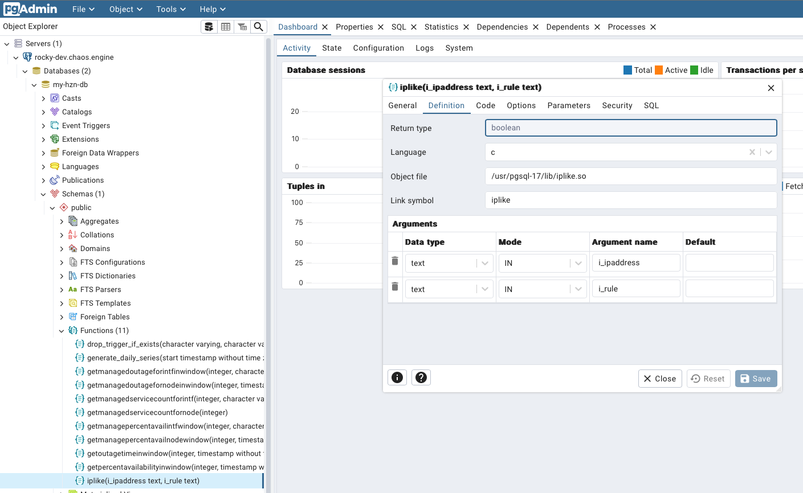
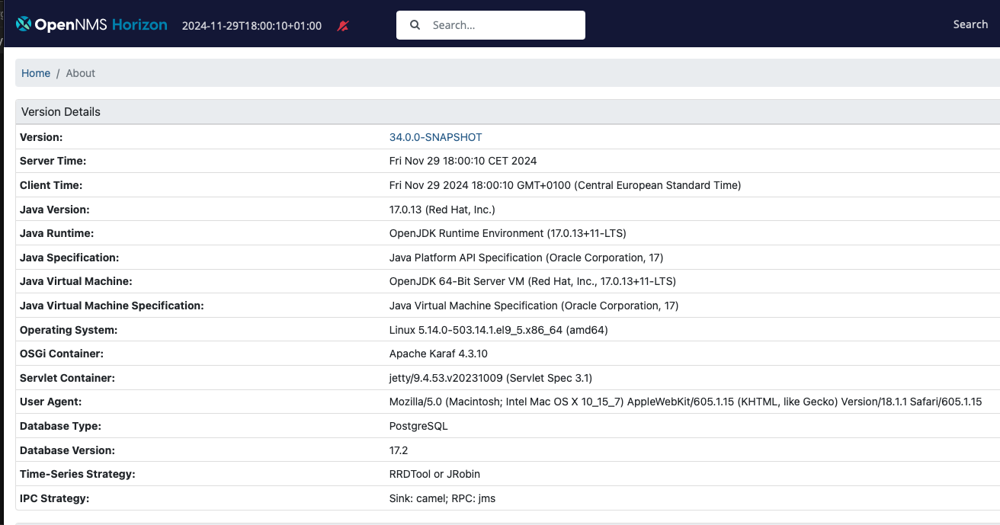

As described in the [previous article]() we have built and installed an OpenNMS Horizon Core component from the source.

With setting up the database schema with `${OPENNMS_HOME}/bin/install -dis` a function `IPLIKE` is created for the OpenNMS database.

It allows us to get IP address matches for IPv4 and IPv6 addresses with filters used in all IP filters in the tool, e.g. `IPADDR IPLIKE 192.168.0-3.0-255`.

By default, the function is implemented in a SQL procedural language (PL/pgSQL).
As OpenNMS had to deal with larger IP address inventories, an optimized version in C was created which is available as the IPLIKE package.
The C version of this stored procedure has to be built against header files from specific PostgreSQL major versions.
This is the reason you see `iplike-pgsql{12,13,14,15}` packages in the [OpenNMS repositories](https://cloudsmith.io/~opennms/repos/common/packages/?q=iplike).

If you don't install the iplike package a `plpgsql` function will be created.
You can verify the IPLIKE implementation language by connecting to your database and inspecting the details of the iplike function.

```bash
[rocky@rocky-dev iplike]$ psql -U my-hzn-user -d my-hzn-db -h localhost
```

Get the details of the iplike function with

```psql
my-hzn-db=> \df+ iplike
```

The first line in the column `Language` should give you `plpgsql` followed by the function itself.

```psql
public | iplike | boolean          | i_ipaddress text, i_rule text | func | volatile   | unsafe   | opennms | invoker  |                   | plpgsql  |
```

**💁‍♀️** If you use a tool like [pgadmin](https://www.pgadmin.org) you can inspect the function implementation very easily.



You can test the function with an SQL command and enable `\timing` to measure the execution time.
In the example, I have loaded ~16k Nodes into the inventory with a unique address from the 10.0.0.0/18 IP range.

```psql
my-hzn-db=> \timing
Timing is on.
my-hzn-db=# select count(IPLIKE(ipaddr,'10.*.*.*')) from ipinterface;
 count
-------
 16391
(1 row)

Time: 194.280 ms
```

Matching addresses takes ~194 ms with the plpsql implemented function.
If we do the same thing with the C-implemented iplike function you will see the following output:

```psql
my-hzn-db=# \df+ iplike
                                                                                 List of functions
 Schema |  Name  | Result data type |      Argument data types      | Type | Volatility | Parallel |  Owner   | Security | Access privileges | Language | Sourc
e code | Description
--------+--------+------------------+-------------------------------+------+------------+----------+----------+----------+-------------------+----------+------
-------+-------------
 public | iplike | boolean          | i_ipaddress text, i_rule text | func | volatile   | unsafe   | postgres | invoker  |                   | c        | iplik
e      |
(1 row)
```

Running the same query against the inventory gives the following output:

```psql
my-hzn-db=> \timing
Timing is on.
my-hzn-db=# select count(IPLIKE(ipaddr,'10.*.*.*')) from ipinterface;
 count
-------
 16391
(1 row)

Time: 19.093 ms
```

As you can see we have a 10x faster response from the C-implemented function.
The iplike function helps to reduce the internal latency of the monitoring system which allows us to deal with larger workloads.

## Build Iplike from source

If you want to use newer PostgreSQL versions where OpenNMS hasn't published RPM or Debian packages, you can build the functions from the source code.

### Requirements:

* Rocky Linux 9 minimal server install
* Access to public Rocky Linux package repositories
* Access to the official PostgreSQL package repositories
* Access to GitHub and git
* Working directory is the home directory for a user `rocky` (`/home/rocky`)
* Make sure you don't have an OpenNMS Horizon Core instance running

Install the PostgreSQL repository and the development header files from the major version you want to run in your environment.
I use PostgreSQL 17 here as an example.

Install the build dependencies
```bash
sudo dnf install -y autoconf libtool
```

You need to install the Rocky Linux Code Ready Builder (crb).
```bash
sudo dnf config-manager --enable crb
```

Without access to the `crb` repository, you get the following error message when you try to install the `postgresql17-devel` package:

```bash
Error:
 Problem: cannot install the best candidate for the job
  - nothing provides perl(IPC::Run) needed by postgresql17-devel-17.2-1PGDG.rhel9.x86_64 from pgdg17
(try to add '--skip-broken' to skip uninstallable packages or '--nobest' to use not only best candidate packages)
```

Install the official PostgreSQL 17 repository, server, and developer files.
```bash
sudo dnf install -y https://download.postgresql.org/pub/repos/yum/reporpms/EL-9-x86_64/pgdg-redhat-repo-latest.noarch.rpm
sudo dnf install -y postgresql17-server postgresql17-devel
```

Checkout the source code from GitHub.
```bash
git clone https://github.com/opennms/iplike
```

Get the git submodules for autotools.
```bash
cd iplike
git submodule update --init
```

Generate the configure scripts.
```bash
./configure
```

You will get an error message.
```
configure: error: PostgreSQL is required
```

You need to tell the configure script the location of your `pg_config` binary for the version you want to use.
```bash
./configure --with-pgsql=/usr/pgsql-17/bin/pg_config
```

Compile and install the library with
```
make && sudo make install
```

The libraries and an install script are installed in the following locations:
```bash
[rocky@rocky-dev iplike]$ ls -l /usr/pgsql-17/lib/iplike.*
-rwxr-xr-x. 1 root root   915 Nov 29 17:19 /usr/pgsql-17/lib/iplike.la
-rwxr-xr-x. 1 root root 59176 Nov 29 17:19 /usr/pgsql-17/lib/iplike.so

[rocky@rocky-dev iplike]$ ls -l /usr/local/sbin/*iplike*
-rwxr-xr-x. 1 root root 2189 Nov 29 17:19 /usr/local/sbin/install_iplike.sh
```

Initialize the PostgreSQL 17 database.
```bash
sudo postgresql-17-setup initdb
```

Prepare the database for the OpenNMS Horizon installation.


```bash
sudo -i -u postgres createuser -P my-hzn-user
```

Set a secure password, in this example, I use `my-hzn-user-pass` as a password to describe these steps.
Create a database and set the owner accordingly.
```bash
sudo -i -u postgres createdb -O my-hzn-user my-hzn-db
```

Set a secure password for the `postgres` user.
```bash
sudo -i -u postgres psql -c "ALTER USER postgres WITH PASSWORD 'my-postgres-pass';"
```

Install the iplike function into the OpenNMS Horizon database.
```bash
[rocky@rocky-dev iplike]$ /usr/local/sbin/install_iplike.sh -d my-hzn-db
Password for user postgres:
CREATE FUNCTION
```

Initialize the database schema for OpenNMS Horizon.
```bash
sudo -u opennms /opt/opennms/bin/install -dis
```

You get an "Unsupported database version" error message.
```
17:37:33.696 [Main] INFO  org.opennms.core.schema.Migrator - validating database version
java.lang.reflect.InvocationTargetException
        at java.base/jdk.internal.reflect.NativeMethodAccessorImpl.invoke0(Native Method)
        at java.base/jdk.internal.reflect.NativeMethodAccessorImpl.invoke(NativeMethodAccessorImpl.java:77)
        at java.base/jdk.internal.reflect.DelegatingMethodAccessorImpl.invoke(DelegatingMethodAccessorImpl.java:43)
        at java.base/java.lang.reflect.Method.invoke(Method.java:569)
        at org.opennms.bootstrap.Bootstrap$4.run(Bootstrap.java:524)
        at java.base/java.lang.Thread.run(Thread.java:840)
Caused by: org.opennms.core.schema.MigrationException: Unsupported database version "17.200001" -- you need at least 10.000000 and less than 17.000000.  Use the "-Q" option to disable this check if you feel brave and are willing to find and fix bugs found yourself.
        at org.opennms.core.schema.Migrator.validateDatabaseVersion(Migrator.java:337)
        at org.opennms.core.schema.Migrator.setupDatabase(Migrator.java:1008)
        at org.opennms.install.Installer.install(Installer.java:248)
        at org.opennms.install.Installer.main(Installer.java:1009)
        ... 6 more
```

You need to run the `install` tool with the option `-Q` to ignore the database version.
```bash
sudo -u opennms /opt/opennms/bin/install -disQ
```

Verify the language of the installed iplike function.
```bash
[rocky@rocky-dev iplike]$ psql -U my-hzn-user -d my-hzn-db -h localhost
Password for user my-hzn-user:
psql (17.2)
Type "help" for help.

my-hzn-db=> \df+ iplike
                                                                                  List of functions
 Schema |  Name  | Result data type |      Argument data types      | Type | Volatility | Parallel |  Owner   | Security | Access privileges | Language | Inte
rnal name | Description
--------+--------+------------------+-------------------------------+------+------------+----------+----------+----------+-------------------+----------+-----
----------+-------------
 public | iplike | boolean          | i_ipaddress text, i_rule text | func | volatile   | unsafe   | postgres | invoker  |                   | c        | ipli
ke        |
(1 row)

my-hzn-db=>
```

Start OpenNMS Horizon core with
```
[rocky@rocky-dev iplike]$ sudo systemctl start opennms
```

Login to your OpenNMS Horizon Core web user interface and you should now run on the latest and greatest PostgreSQL 17.2 version.



gl&hf

## What can we do next?

There are now additional steps we can take from here, most notably:

* [JNA vs. JNI ICMP performance implications]()
* [Compile and install RRDTool support using JRRD2]()
* Building Core, Minion, and Sentinel RPM packages
* Create Docker container images

Stay tuned and so long
