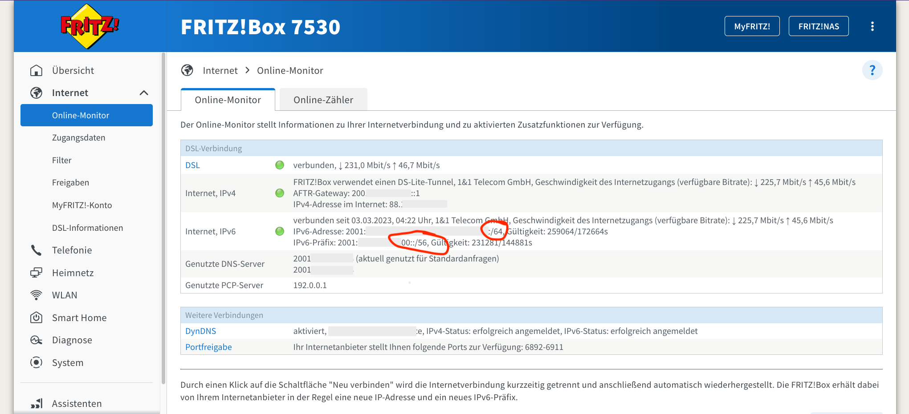
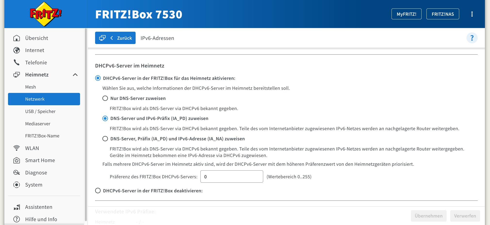
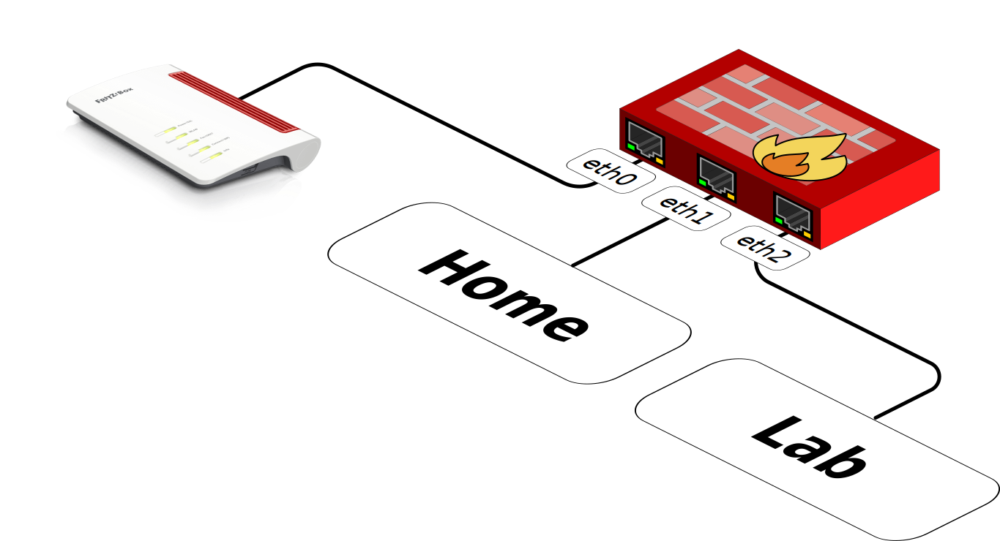
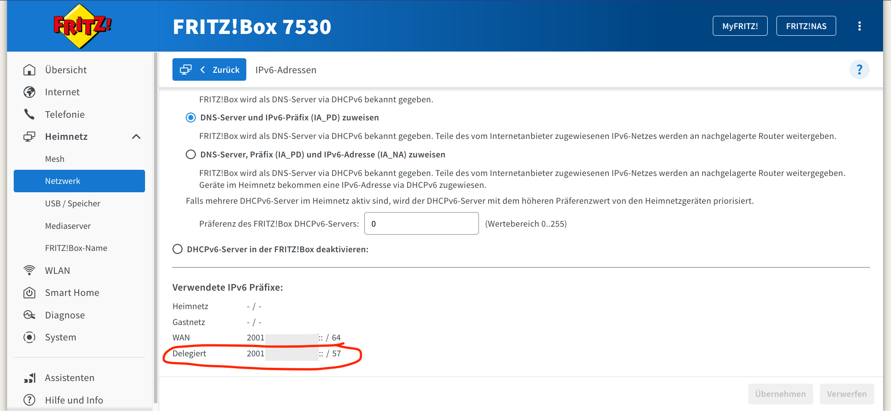
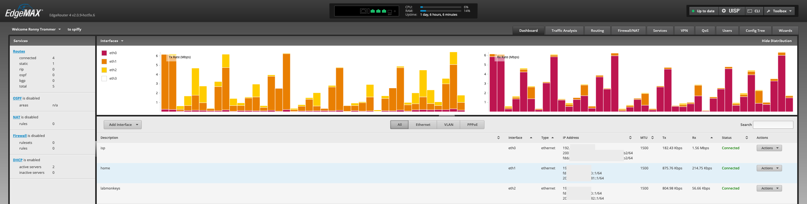

I started working remotely in 2010 for OpenNMS as an open-source network monitoring advocate.
I have a little home lab with some real hardware that allows me to play on various things without giving me a big surprise bill from a cloud provider at the end of the month.
I have a FRITZ!Box 7530 connected to my ISP 1&1.
I get native IPv6 and IPv4 connectivity over an IPv4-in-IPv6-Tunnel.
As my main router, I have a Ubiquiti ER-4.
It gives me enhanced firewall capabilities and flexibility, especially with routing protocols like OSPF and BGP.
I have two networks, one for my work-related stuff and another with all the fun crap you have for fun at home.

I had to look around certain tutorials to figure out how I can get IPv6 connectivity behind my Ubiquiti router running with EdgeRouter 4 v2.0.9-hotfix.6.
To make my life easier I've documented my things here for my future self and others.
First of all, see if your ISP gives you the ability to delegate IPv6 networks to your router.
My provider gives me an IPv6 /64 network and you should also get a second prefix for delegation.
In my case, I get a /56 prefix all looks good to dig into IPv6 delegation.



The next step is requesting a prefix and delegating to your router behind.
Enable the prefix delegation option (IA_PD) and save your settings.



The Ubiquiti router can now request individual prefixes from the /56 network and can assign them to your internal networks.
My network setup with network interfaces looks like this.



Login to your Ubiquiti router and configure the prefix delegation function for the interfaces.
In my case eth1 and eth2 where I want IPv6 connectivity and request a half of the /56 address space.


```plain
indigo@spiffy# configure

indigo@spiffy# show interfaces ethernet eth0
 address 192.168.178.2/24
 description isp
 dhcpv6-pd {
     pd 0 {
         interface eth1 {
             host-address ::1
             prefix-id :1
             service slaac
         }
         interface eth2 {
             host-address ::1
             prefix-id :2
             service slaac
         }
         prefix-length 57
     }
     rapid-commit enable
 }
 duplex auto
 ipv6 {
     address {
         autoconf
     }
     dup-addr-detect-transmits 1
 }
 speed auto
[edit]
```

You can verify on your FRITZ!Box if a /57 prefix is delegated.



For each interface, a request for a prefix is requested, and stateless address autoconfiguration for IPv6 is used.
The interfaces get now a public IPv6 address assigned and are distributed accordingly to the clients in the networks.



So long, and thanks for all the fish!
