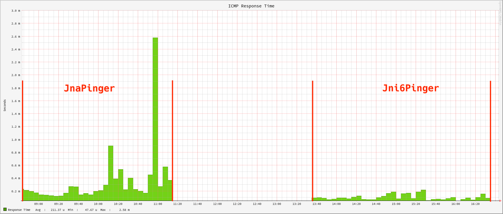

As described in the [previous article]() we have build an OpenNMS Horizon Core component from source.
If you don't do anything else, it will uses an [ICMP](https://en.wikipedia.org/wiki/Internet_Control_Message_Protocol) implementation using [Java Native Access](https://en.wikipedia.org/wiki/Java_Native_Access) (JNA).
The big benefit here, it's all Java and supports IPv4 and IPv6.
You also don't need additional permissions on your Linux system such as `net.ipv4.ping_group_range` and [SELinux](https://en.wikipedia.org/wiki/SELinux).
It makes it perfect for local development and also if you want to run OpenNMS on exotic architectures where you can't easily compile or build the JNI equivalent written in C from the source code.
The downside it comes with some overhead for each ICMP service test.
You can see the effect on the latency measurements, especially on very fast responding IP addresses, such as the local loopack interface.

Jni6Pinger measuring latency against the same local IPv6 address


The image gives you a similar time frame testing the ICMP response times using the JNA implementation compared with the measured response times from the JNI implementation.

**💁‍♀️** In production environments, it would be fair to say to use the JNI 6 pinger to get a) faster release of Pollerd threads with large ICMP service test workloads and b) more accuracy for latency measurements. This will also be valid if [StrafePing](https://docs.opennms.com/horizon/33/reference/service-assurance/monitors/StrafePingMonitor.html) for monitoring [Jitter](https://en.wikipedia.org/wiki/Jitter) is used.

In this session we want to go through the process compiling and building the JICMP and JICMP6 libraries from source code on Rocky Linux 9.

## Requirements

* Working directory is the home directory of a user who can do administrative tasks with `sudo` , in this case a user `rocky` in `/home/rocky`
* You need `git`, internet access to GitHub, and access to public Rock Linux packages
* For this session, I'm using the installed OpenNMS Horizon Core instance from the [OpenNMS - Auf die harte Tour]() article which is using the JnaPinger by default
* The configuration scripts are generated with `autoconf` and `libtool` (`sudo dnf install -y autoconf libtool`)
* **☢️** JICMP and JICMP6 use `javah` to build the C header and source files from Java classes. `javah` is removed with OpenJDK 10. You have to install a JDK 8 Development Kit to make it work (`dnf install -y java-1.8.0-openjdk-devel`).

## Build JICMP

The JICMP library, is implementing ICMP for IPv4 only.
It will be referenced in Pollerd as `org.opennms.netmgt.icmp.jni.JniPinger`.

```bash
git clone https://github.com/opennms/jicmp
```

Generate the configure scripts

```bash
cd jicmp
autoreconf -fvi
```

Configure the build environment.
The configure script will pick automatically Java 8 even when you have more than one JDK installed.

**💁‍♀️** The options `--with-java=JAVA_HOME` and `--with-jvm-arch=(32|64)` can be applied to the `./configure` script in case you have a very specific build environment.

```bash
./configure
```

Compile and install the JAR and shared object library with

```bash
make && sudo make install
```
The JAR and the library will be installed to

```
/usr/local/share/java/jicmp.jar
/usr/local/lib/libjicmp.so
/usr/local/lib/libjicmp.la
```

## Build JICMP6

The JICMP library, is implementing ICMP for IPv4 and IPv6.
It will be referenced in Pollerd as `org.opennms.netmgt.icmp.jni6.Jni6Pinger`.
The installation procedure is exactly the same as for JICMP.

```bash
git clone https://github.com/opennms/jicmp6
```

Generate the configure scripts

```bash
cd jicmp6
autoreconf -fvi
```

Configure the build environment.
The configure script will pick automatically Java 8 even when you have more than one JDK installed.

**💁‍♀️** The options `--with-java=JAVA_HOME` and `--with-jvm-arch=(32|64)` can be applied to the `./configure` script in case you have a very specific build environment.

```bash
./configure
```

Compile and install the JAR and shared object library with

```bash
make && sudo make install
```
The JAR and the library will be installed to

```
/usr/local/share/java/jicmp6.jar
/usr/local/lib/libjicmp6.so
/usr/local/lib/libjicmp6.la
```

## Configure OpenNMS Horizon with JICMP and JICMP6

To make the Horizon Core instance aware of the libraries, you can use the `install` command in the OpenNMS bin directory.
It's better to stop the Core service first.

```bash
sudo systemctl stop opennms
sudo -u opennms /opt/opennms/bin/install -dS
```

The following lines are important:

```
DEBUG: Platform is IPv6 ready: true
- searching for libjicmp.so:
  - trying to load /usr/local/lib/libjicmp.so: OK
- searching for libjicmp6.so:
  - trying to load /usr/local/lib/libjicmp6.so: OK
```

The path will be written to the `/opt/opennms/etc/libraries.properties` file which is used during startup.

When you start up the Core service, look at the `manager.log`.
The algorithm detecting the Ping implementation tells you if OpenNMS Horizon is able to use it.

If you see permission errors look at the [Troubleshooting ICMP permissions](https://opennms.discourse.group/t/h29-wont-start-with-permission-error-to-open-icmp-socket/2387?u=indigo) article which helps you to solve this problem.

If you don't want to rely on the algorithm to determine the best ICMP implementation for Ping, you can enforce it by setting the `org.opennms.netmgt.icmp.pingerClass` property in `/opt/opennms/etc/opennms.properties.d/icmp.properties`.

```
# To use the JNI ICMPv4/ICMPv6 implementation, use the following property:
#org.opennms.netmgt.icmp.pingerClass=org.opennms.netmgt.icmp.jni6.Jni6Pinger
#
# To use the JNI ICMPv4 interface only, use the following property:
#org.opennms.netmgt.icmp.pingerClass=org.opennms.netmgt.icmp.jni.JniPinger
#
# To use the JNA ICMPv4/ICMPv6 implementation, use the following property:
#org.opennms.netmgt.icmp.pingerClass=org.opennms.netmgt.icmp.jna.JnaPinger
```

**☢️** You can't install just JICMP6 alone. When I started OpenNMS with that configuration. The Ping implementation algorithm will fallback to JNA. If you enforce it with the property, the startup will crash with a thread dump like shown below with `journalctl -u opennms`.

```
Nov 28 13:16:55 rocky-dev systemd[1]: opennms.service: Supervising process 2701 which is not our child. We'll most likely not notice when it exits.
Nov 28 13:17:22 rocky-dev systemd[1]: opennms.service: Supervising process 2701 which is not our child. We'll most likely not notice when it exits.
Nov 28 13:22:03 rocky-dev systemd[1]: Stopping OpenNMS server...
Nov 28 13:22:05 rocky-dev opennms[2701]: 2024-11-28 13:22:05
Nov 28 13:22:05 rocky-dev opennms[2701]: Full thread dump OpenJDK 64-Bit Server VM (17.0.13+11-LTS mixed mode, sharing):
Nov 28 13:22:05 rocky-dev opennms[2701]: Threads class SMR info:
Nov 28 13:22:05 rocky-dev opennms[2701]: _java_thread_list=0x00007f832acaa2b0, length=488, elements={
Nov 28 13:22:05 rocky-dev opennms[2701]: 0x00007f83cc135f60, 0x00007f83cc137350, 0x00007f83cc140660, 0x00007f83cc141a20,
Nov 28 13:22:05 rocky-dev opennms[2701]: 0x00007f83cc142e20, 0x00007f83cc144240, 0x00007f83cc145c00, 0x00007f83cc147140,
Nov 28 13:22:05 rocky-dev opennms[2701]: 0x00007f83cc1505a0, 0x00007f83cc15bc30, 0x00007f83cc18b0e0, 0x00007f83cc02d950,
Nov 28 13:22:05 rocky-dev opennms[2701]: 0x00007f832909e910, 0x00007f832949e080, 0x00007f8329554290, 0x00007f8329555030,
Nov 28 13:22:05 rocky-dev opennms[2701]: 0x00007f8329556420, 0x00007f83295574d0, 0x00007f8329559780, 0x00007f832955c100,
Nov 28 13:22:05 rocky-dev opennms[2701]: 0x00007f832955d100, 0x00007f832955e100, 0x00007f83299cf3f0, 0x00007f8328f14670,
Nov 28 13:22:05 rocky-dev opennms[2701]: 0x00007f8328caec90, 0x00007f8328cb18e0, 0x00007f8328cb1e60, 0x00007f8328f130b0,
```

## Creating RPM packages

When you run the `./configurè` scripts, you need verify the following output:

```
checking for rpmbuild... no
*** RPM Configuration Failed
*** Failed to find the rpmbuild program.  If you want to build rpm packages
*** indicate the path to the rpmbuild program using  --with-rpmbuild-prog=PROG
```

To solve this optional build dependency, you need to install the RPM build environment.

```bash
sudo dnf install -y rpm-build
```

Re-run `./configure` and you should have now a RPM configuration which should look like this:

```
checking for rpmbuild... /usr/bin/rpmbuild
checking how rpm sets %{_rpmdir}... /home/rocky/rpmbuild/RPMS
checking how rpm sets %{_srcrpmdir}... /home/rocky/rpmbuild/SRPMS
checking where RPMs end up... /home/rocky/rpmbuild/RPMS/$(RPM_ARCH)/$(PACKAGE)-$(VERSION)-$(RELEASE).$(RPM_ARCH).rpm
checking where source RPMs end up... /home/rocky/rpmbuild/SRPMS/$(PACKAGE)-$(VERSION)-$(RELEASE).src.rpm
checking where source files go... /home/rocky/rpmbuild/SOURCES
```

The configure scripts, gives you now the additional make goal `rpm` which you can run with

```bash
make rpm
```

The RPM and SRPM build artifacts are located in your home directory in `${HOME}/rpmbuild`

The procedure for JICMP and JICMP6 is exactly the same.

## What can we do next?

There are now additional steps we can take from here, most notably:

* [Compile and install IPLIKE stored procedure in PostgreSQL]()
* Compile and install RRDTool support using JRRD2
* Building Core, Minion, and Sentinel RPM packages
* Create Docker container images

Stay tuned and so long
