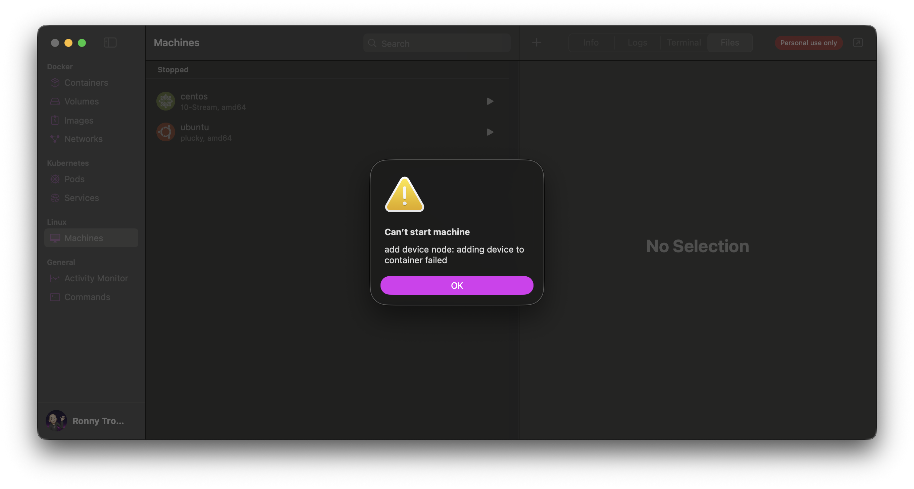
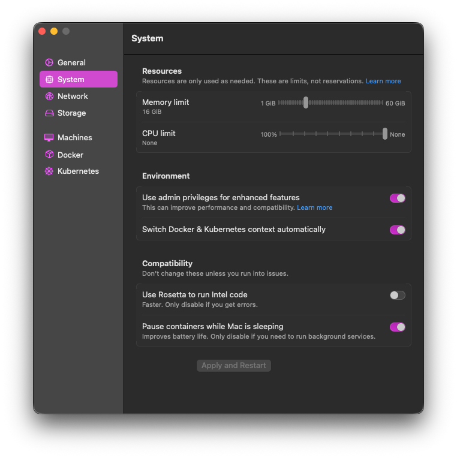

I'm maintaining container images in the OpenNMS ecosystem.
My local machine is a Mac with Apple Silicon.
While I was upgrading some base images using RHEL UBI 10 / CentOS 10 images, I noticed the following error message.

```plaintext
0.112 Fatal glibc error: CPU does not support x86-64-v3
```

That happens if you try to run on an emulated x86 architecture running on ARM.
After some investigation, I've found an [article](https://developers.redhat.com/articles/2024/01/02/exploring-x86-64-v3-red-hat-enterprise-linux-10#verifying_performance_improvements) in the Red Hat developer forum talking about upgrading the [Microarchitecture level](https://en.wikipedia.org/wiki/X86-64#Microarchitecture_levels) from v2 to v3.
The problem introduced is that v3 isn't supported.
I'm using [Orbstack](https://orbstack.dev/) and you can reproduce this problem simply running the following docker command.

```plaintext
docker run --platform=linux/amd64 --rm -it registry.access.redhat.com/ubi10/ubi:10.0
Unable to find image 'registry.access.redhat.com/ubi10/ubi:10.0' locally
10.0: Pulling from ubi10/ubi
af063699af1c: Pull complete
Digest: sha256:9bd3aebdfdf6eebb6a18541d838cac9e9a35d2f807aa8e36d9518978cc86371f
Status: Downloaded newer image for registry.access.redhat.com/ubi10/ubi:10.0
Fatal glibc error: CPU does not support x86-64-v3
```

When you start a CentOS 10 virtual machine with the x86-64 emulation, you get the following error message.



You can fix it by changing the underlying emulation QEMU by disabling Rosetta.



The Rosetta emulation only supports instructions within Microarchitecture level v2.
There is some performance penalty with it because Rosetta is faster.

So long ...
