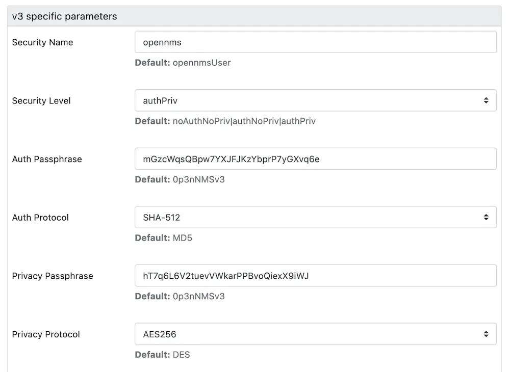

To monitor your systems you rely heavily on SNMP, it gives out of the box a lot of possibilities getting important performance and status information.

The main topic security is often not considered.
SNMP version 1 and 2c transmit everything in plain text over the wire.
There is also no user, password authentication method, just a shared community string which gives access to the information.
To address these problems [SNMP v3](http://en.wikipedia.org/wiki/Simple_Network_Management_Protocol#SNMPv3) was introduced.

The Linux Net-SNMP agent supports SNMP v3 and OpenNMS does as well, so nothing prevents us to use encryption and user authentication.

☢️ Net-SNMP earlier than 5.8 uses *[SHA-1](https://shattered.io/)* which is not secure enough these days.
You need [Net-SNMP 5.8+](http://net-snmp.sourceforge.net/wiki/index.php/Strong_Authentication_or_Encryption) to get stronger security algorithms.

Nevertheless, here is the way to configure SNMP v3 with Net-SNMP and OpenNMS Horizon.

## Make your Net-SNMP configuration modular

Today, people running configuration management tools rolling out configurations to a lot of systems.
Net-SNMP gives you the possibility to use an include drop-in folder to extend the default configuration, which is very handy to include device dependent configuration snippets.

All you have to do is to add the following line in your `snmpd.conf`

```sh
includeDir /etc/snmp/conf.d
```

All files ending with `.conf` will now be added to your Net-SNMP configuration.
This makes it using configuration management tools to add device dependent disk, process or log monitoring directives without mangling one large `snmpd.conf` with variables.

## How to configure Net-SNMP with SNMP v3

The first step, create a user with password and tell the agent what methods for encryption and signature should be used.
You can create for example a file in `/etc/snmp/conf.d/version-3.conf` with the following content:

```sh
createUser opennms SHA-512 "mGzcWqsQBpw7YXJFJKzYbprP7yGXvq6e" AES-256 "hT7q6L6V2tuevVWkarPPBvoQiexX9iWJ"
rouser opennms authpriv
```

The command creates a user named `opennms` and uses [SHA](https://en.wikipedia.org/wiki/Secure_Hash_Algorithms) as  [Message Authentication Code](http://en.wikipedia.org/wiki/HMAC).
For encryption you have the choice between [DES](http://en.wikipedia.org/wiki/Data_Encryption_Standard) and [AES](http://en.wikipedia.org/wiki/Advanced_Encryption_Standard), I would recommend the newer AES with 256bit key length as the encryption method.
I can recommend using something like [apg](http://linux.die.net/man/1/apg) to create better passwords.

Once you added the configuration you have to restart the Net-SNMP daemon and you can test it with the following command:

```sh
snmpget -v 3 -u opennms -l authPriv -a SHA-512 -A "mGzcWqsQBpw7YXJFJKzYbprP7yGXvq6e" -x AES-256 -X "hT7q6L6V2tuevVWkarPPBvoQiexX9iWJ" localhost .1.3.6.1.2.1.1.6.0
```

You should be able to get the system location.

🚓 I recommend deleting the `createUser` statement with your clear key credentials after the first start of `snmpd`.
The command is just read once to create the user entry encrypted in the `/var/lib/snmp/snmpd.conf`. 

Next, you can configure OpenNMS to use SNMP v3 for your IP address or a whole range in the Web UI by going to "Admin -> Configure SNMP Community by IP".



## Troubleshooting Net-SNMP

When you start the Net-SNMP daemon with the `createUser` statement from your Net-SNMP configuration file, a user entry is created in `/var/lib/snmp/snmpd.conf` and looks something like this:

```plain
usmUser 1 3 0x80001f8880b37e0604eaef6d6400000000 "opennms" "opennms" NULL .1.3.6.1.6.3.10.1.1.7 0x3634e92b399aea2f0e41d59adf2ae0ea2c3d5e7f5ea1867f589055c59ef24676c2c35611fe0711a40031fe6b7b8b557798f28446975c922dc013165064f70cbe .1.3.6.1.4.1.14832.1.4 0xce92a545ca3467517a92277836d1760321b4f9c9987073c69fb2259335902945 ""
```

When you want to change the password, digest or encryption algorithm for the same user, you need to delete this entry first.

1. Stop the SNMP daemon with `systemctl stops snmpd`.
2. Delete the `usmUser` entry in `/var/lib/snmp/snmpd.conf`.
3. Adjust your `createUser` statement as you need it
4. Start the SNMP daemon with `systemctl start snmpd`
5. Delete the `createUser` statement from your configuration file

That's it – happy monitoring.
