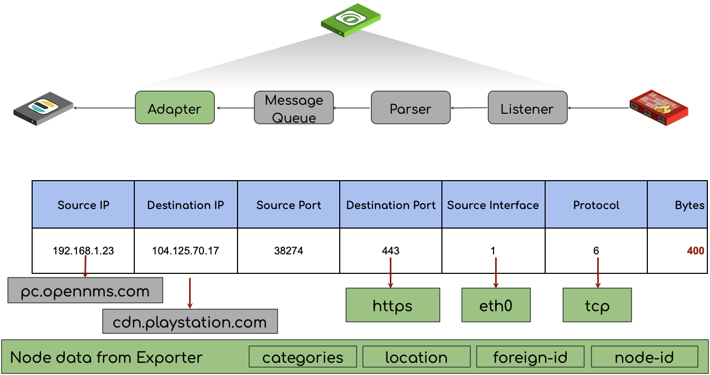
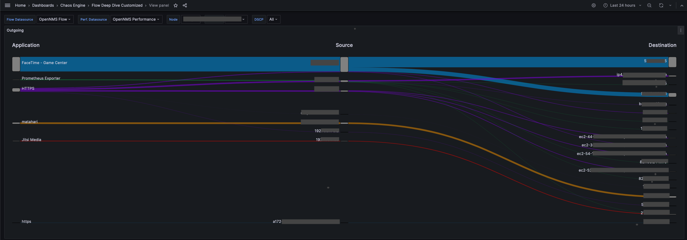

Getting metrics about the utilization of network interfaces isn't very complicated these days.
Most of the time your network gear is instrumented with an SNMP agent which you can use to measure it or if you get modern, they have telemetry streaming, and they send you measurements with protocols like gNMI.
I'm not explaining fancy new tech here, everything mentioned here is old, but your devices might have these capabilities but aren't exploited :)

So what most people do is measure the incoming and outgoing octet (8bit) counter of a network interface in a regular interval and what you get normally is a graph that can look like the one below.

In OpenNMS Horizon or other monitoring tools, you can try to apply some algorithms to see a trend for the future, in simple cases, you can do this with a linear projection.
There are also a bit more sophisticated algorithms available.
In OpenNMS, we have adopted the Holt-Winters approach which is exponential smoothing modeled on the aspects of an average, trend, and seasonality.

This is fine for a baseline and can answer some questions about managing your capacity.
In some weird cases, they can also help you identify misconfiguration or other problems because some knowledgeable people understand how the network was built, what services are deployed, and how people usually use it.
If you talk with people they will sometimes say things like: "We shouldn't have that much traffic on that interface because of x,y, and z".
My analogy is talking to a very good mechanic looking at your car understanding, that additional heat on your exhaust correlates to higher fuel consumption, and knowing now there might be something wrong.
This is the situation when people receive a signal out of noise but can't point a finger at the source of the problem immediately.

To help people in these situations we have added the capability to process and persist NetFlow with OpenNMS Horizon.
It gives us a way to tell someone who is talking and what they are talking about on a network interface.
To make that happen, your network device needs to implement NetFlow protocols.
If you go shopping for network equipment make sure SNMP and flow accounting are part of the required capabilities list.

In a nutshell, instead of counting bytes on the whole interface, you get now bytes and packets counter on every conversation through a specific network interface.
Additionally, the sampling of that data is very accurate and sent from the router instead of polling every x seconds to measure a counter.
Your network device turns into a flow exporter, and you have to tell them where you want to send the flow records to.
The receiving end processing these flow records is called a flow collector.

The ability to collect and process NetFlow can now give some additional dimensions to that bandwidth graph.
With our Grafana data source, you can see now besides the SNMP bandwidth graph what applications and which endpoints consume the capacity of that interface.
A key topic you need to be aware of is, the observation point is a network interface.
So the context of looking at a router as a flow exporter and the network interface is important to know interpret the data later on.

The tricky thing with flow data, they need to be enriched to make them useful.
Having the Router which exports flows needs to be monitored with OpenNMS and requires also to have SNMP enabled.
That way we can resolve internal source interface identifiers to something human-readable like `eth0`.

OpenNMS enriches the flow record with a human-readable application name coming from our classification engine and some other inventory data, such as node labels, categories, and the monitoring location in case a Minion was the flow collector in a monitoring location.
The data is persisted in Elasticsearch with all the enrichment's.
By default, we do also reverse DNS lookups, to make IP addresses more meaningful.
This allows the user to investigate the data more openly with Kibana or any other visualization method than Grafana.

In OpenNMS Horizon the core server can act as a flow collector or if you have a distributed network with remote offices, the Minion can take this role.
The component that takes this job is Telemetryd.
It works as an xFlow collector which can collect all common flow protocols on a single port and will use the correct protocol parser automatically.
In the `telemetry-configuration.xml` we call this `Multi-UDP-9999` and listens by default on port 9999/udp.

The shipped flow deep dive dashboard is purely focused on a network interface right now and gives additional depth to the bandwidth graph.

Besides that, you can also try other visualization types like Sankey which visualizes volume on the application between network endpoints.

In the follow article, I'll look a bit deeper how can deploy OpenNMS Horizon with Minions.

To be continued ...

Featured image by [Quangpraha](https://pixabay.com/users/quangpraha-7201644/) from [Pixabay](https://pixabay.com/photos/sea-ocean-flow-reef-rocks-shore-3025268/)
