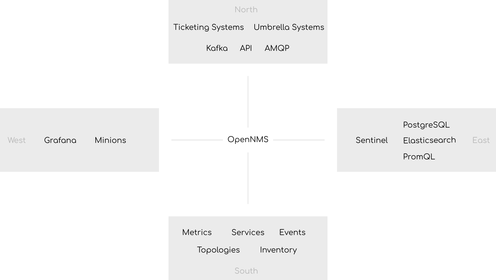

Dealing with secrets in a monitoring platform is a tedious task.
The nature of monitoring systems is providing integrations in as many systems.
Here is my mental model looking at the various ways for integrating OpenNMS.
Especially having a 20 year old platform gives you some very own challenges.
Talking about integration of monitoring systems, 
In OpenNMS Horizon/Meridian (OpenNMS for short), are some places where you have just one option, and some with various options.
This article should help you to get an idea where you need to deal with secrets and credentials.
The north/south areas serve monitoring purpose whereas the west/east directions address scaling topics in the context of volume, geographic or feature sets. 



Secrets in OpenNMS are used for the following use cases:

1. System accounts for the OpenNMS itself, e.g. PostgreSQL as the database, Elasticsearch or Kafka
2. Access to monitored devices or application endpoints
3. Access to the monitoring application as a user
4. Access from 3rd party applications using the ReST API for integration, provisioning via ReST
5. Access to 3rd party applications, external systems, e.g. Mattermost, Slack, E-Mail, etc.

Most of the configuration files have just the option to set credentials in plain text in the `etc` directory from OpenNMS. 
Having file permissions using a `umask 0027` or even `umask 0077` that removes access from group members and others is recommended.

To mitigate plain text credentials in configuration files the [Secure Credentials Vault (SCV)](https://docs.opennms.com/horizon/latest/operation/deep-dive/admin/configuration/scv-configuration.html) was introduced.
It is basically an encrypted Java keystore file storing credentials and can be referenced by an alias.
To make use of it, you need to set a master password in a property `${OPENNMS_HOME}/etc/opennms.properties.d/scv.properties` with the content

```plain
org.opennms.features.scv.jceks.key="my/very/secure/master/password"
```
It's not ideal but at least it limits it to just a single file for protection instead of a bunch of files.

## Where can you use it

The Metadata with the `scv` contex can be used in some but not all places:

+ PostgreSQL database connection in opennms-datasources.xml
* Service detectors during provisioning
* Service monitor configuration in Pollerd configuration
* Performance metric collection in Collectd configuration with SNMP, HTTP/s, JMX, NSClient, VMware, WMI, XML
* Alarmd Drools rules
* Elasticsearch integration: elastic-configuration.xml
* IFTTT integration: ifttt-config.xml
* JCIFS monitor: jcifs.properties
* Notification configuration: javamail-configuration.xml, javamail-configuration.properties, microblog-configuration.xml, xmpp-configuration.xml
* SNMP configuration, SNMP profiles: snmp-config.xml
* Ticketer configuration: jira.properties, remedy.properties, tsrm.properties
* Trapd configuration: trapd-configuration.xml

There are some places, e.g. Karaf configuration files or properties for Kafka connections which don't allow Metadata based credentials.
The configuration files for OpenNMS need to be protected.

## Improvements

If a Metadata context like `env` could be implemented, it would allow to inject credentials from environment variables.
The mechanism is widely adopted, the credentials are in memory at runtime and not persisted in the file system.
Running in container environments and managing credential vaults like [OpenBao](https://openbao.org), [Infisical](https://infisical.com), or [HashiCorp Vault](https://www.vaultproject.io) could make this a bit easier.
Increasing the exposure how environment variables can be used in Karaf configuration and property files could help to limit exposure of credentials as well.
