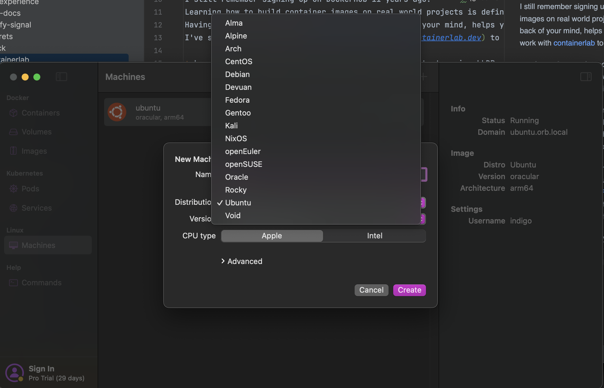
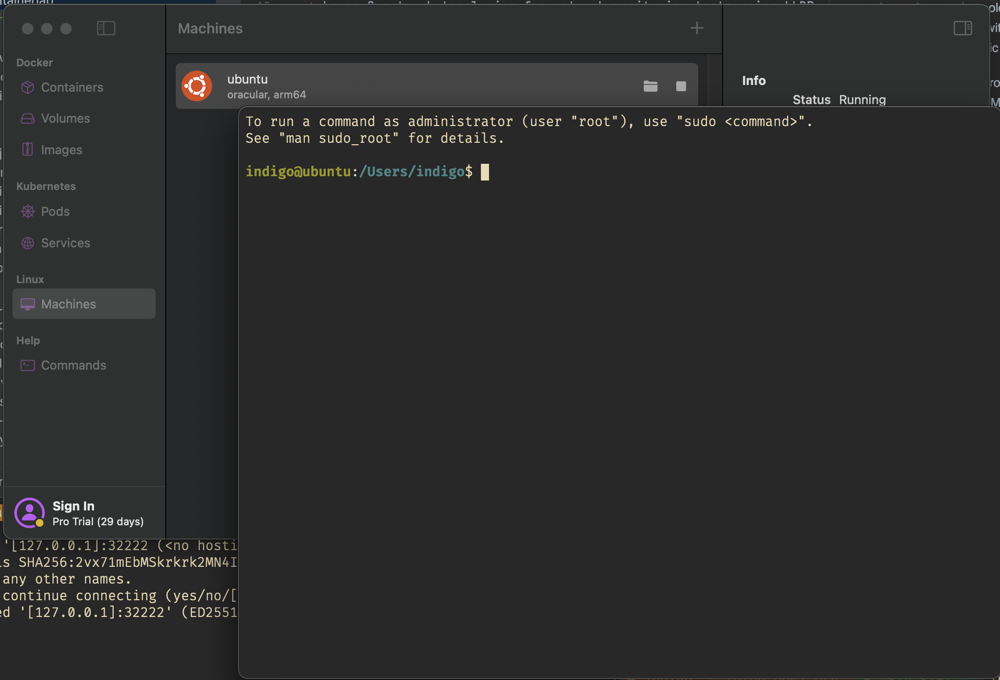

I still remember signing up on DockerHub 11 years ago.
Learning how to build container images on real world projects is definitely a plus.
Having a software and some use cases in the back of your mind, helps you to achieve things quicker and with some purpose.
I've started to work with [containerlab](https://containerlab.dev) to build some network test environments mainly for three use cases:

* Layer 2 network topologies for network monitoring tests using LLDP, CDP and Bridge-MIB
* Routing topologies with protocols like BGP, OSPF or IS-IS in general
* Some vendor specific network gear for monitoring with SNMP and streaming telemetry

Playing with OpenNMS from this perspective opens some use cases around Netflow, IPFIX, BGP monitoring, and SNMP in general.
I was using [Docker4Mac](https://docs.docker.com/desktop/setup/install/mac-install/) for a very long time.
At some point in time I have switched to [colima](https://github.com/abiosoft/colima) which was slim and easy to use.
With switching to ARM on my Mac it got a bit more complicated.

Dealing with x86 only container images made things slow and especially in the containerlab, where you have pretty hungry vendor specific container images.
Fortunately with [FRRouting](https://frrouting.org/) and software like [GoBGP](https://github.com/osrg/gobgp) you can overcome this problem quickly.
Awesome thing I've seen recently is Nokia started to publish their [srlinux](https://github.com/nokia/srlinux-container-image/pkgs/container/srlinux) for ARM as well.
So from the perspective, it seems like life for network geeks using an ARM based system get better every day.

What really leveled up my experience was switching from Docker4Mac to [Orbstack](https://orbstack.dev/).
It was never so easy and quick to get the main Linux distribution I work with up and running on my laptop, if it's ARM or Intel based.

Once you have the virtual machine created, you just double-click and you are in the terminal
If you like to use SSH, just type `ssh orb`.

 
Every virtual machine gets automatically a DNS name like `ubuntu.orb.local`
If you want to deal with multiple VM's, or you need root access, just type `orb -m ubuntu -u root` and you're in.
There is really a lot of love in details in this tool for people like me.
I can highly recommend this video here.
If you want just the Orbstack setup and demo just jump to 25:13.



It's not open source software and let's see how enshittification works on this project.
As far as it is today, it can really help you to smooth your workflow.

So long and merry xmas

Image by [alba1970](https://pixabay.com/users/alba1970-29824635/?utm_source=link-attribution&utm_medium=referral&utm_campaign=image&utm_content=7549180) from [Pixabay](https://pixabay.com//?utm_source=link-attribution&utm_medium=referral&utm_campaign=image&utm_content=7549180)
