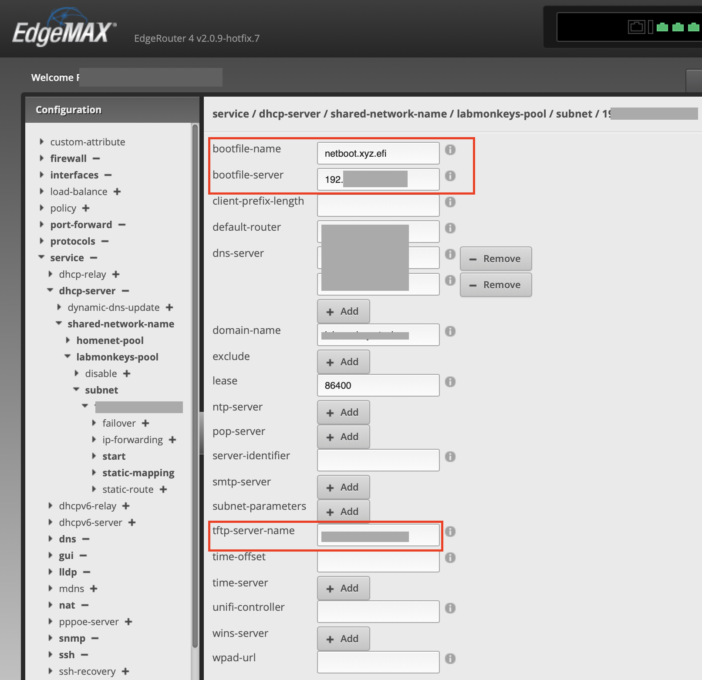
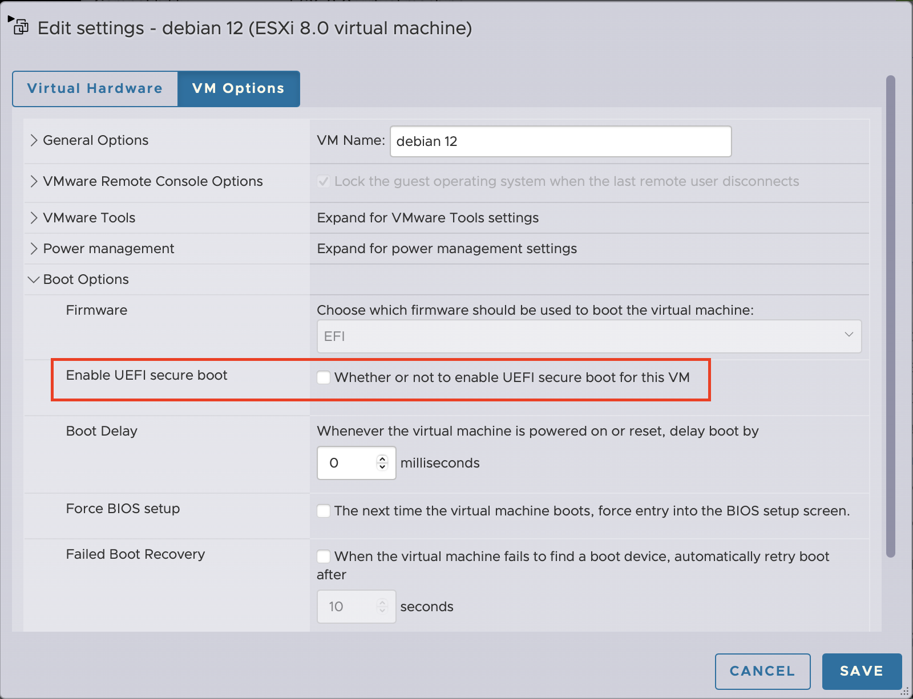
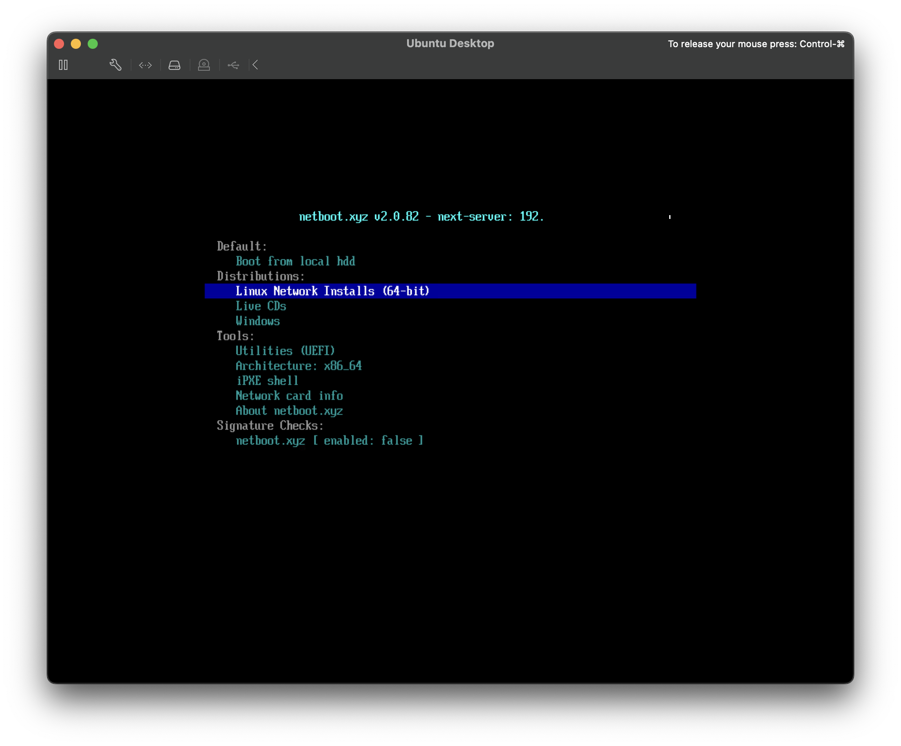

I use a home lab for daily work and for testing purposes, I need to hop between Linux distros often.
I've replaced my homegrown PXE boot environment with [netboot.xyz](https://netboot.xyz).
I built it for a few operating systems and all was good.
I ran into netboot.xyz, and it was quickly pretty clear, this is what you want in a homelab when you have to hop between operating systems using virtual machines.
Reducing the need for building bootable thumb drives or shuffling ISOs around is great.
It has batteries included with boot menu configs, and it works out of the box.
It allows also a lot of customization if needed.
As a reminder to my future self and for others here is my config to get it working quickly.

Get the [docker-compose](https://github.com/netbootxyz/docker-netbootxyz/blob/master/docker-compose.yml.example) file and start it up.
It will give you three services:

* TFTP server on 69/udp
* Web user interface for configuration on 3000/tcp
* Web server on 8080/tcp for local asset delivery

It has batteries included – a boot menu config that is updated via git for new operating systems and tools.

I'm using a Ubiquity Edge Router 4 and the DHCP configuration is pretty straightforward.
You need to configure your DHCP server to deliver a boot server and the boot file name.
My DHCP server is running on Ubiquiti ER-4.
The config for DHCP in my homelab VLAN needs to be configured like this.

Point `bootfile-server` and `tftp-server-name` to the box where you have netboot.xyz running.
If you use UEFI use `netboot.xyz.efi` as the file name, if you use legacy BIOS set it to `netboot.xyz.kpxe`.

If you decide to use UEFI as I did, you need to disable UEFI secure boot.
In VMware you need to edit the VM, go the "VM Options" tab and uncheck the "Enable UEFI secure boot" option in "Boot Options".

When you start up the VM you should get a boot menu that gives you options on what you want to do with your VM.

The next topic might be to add local HTTP caching in case you don't have a big internet pipe.

gl & hf

Image by [WikiImages](https://pixabay.com/users/wikiimages-1897/?utm_source=link-attribution&utm_medium=referral&utm_campaign=image&utm_content=67643) from [Pixabay](https://pixabay.com//?utm_source=link-attribution&utm_medium=referral&utm_campaign=image&utm_content=67643)