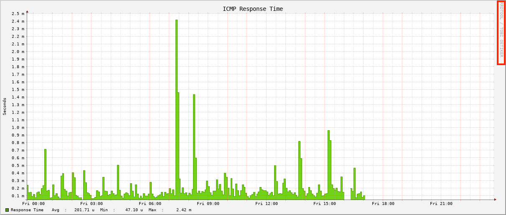

As described in the [previous article]() we have built and installed an OpenNMS Horizon Core component from the source.
It comes with a Java implementation of [RRDTool](https://oss.oetiker.ch/rrdtool/) called [JRobin](https://sourceforge.net/projects/jrobin/).
The portability of Java applications allowed users to run OpenNMS platforms where RRDTool wasn't easily available.
It was threadsafe and allowed more threads writing data.
RRDTool implemented that functionality and surpassed JRobin performance and feature wise.

**💁‍♀️** If you just don't care in a dev or testing environment, you can use JRobin for simplicity, because it's just there and works out of the box.
For any production environment, I highly recommend to use RRDTool.
It gives you much better support for tools, performance and features.
Migrating later is doable but painful.

The implementation uses the [Java Native Interface (JNI)](https://en.wikipedia.org/wiki/Java_Native_Interface) to get us from the Java into the C world of RRDtool.
The native interface for Java to RRDTool is called [JRRD2](https://github.com/opennms/jrrd2).

**💁‍♀️** JRRD2 leverages from threadsafe implementation of RRDTool.
The older project JRRD isn't.

## Requirements

* Working directory is the home directory of a user who can do administrative tasks with `sudo` , in this case a user `rocky` in `/home/rocky`
* You need `git`, internet access to GitHub, and access to public Rock Linux packages
* For this session, I'm using the installed OpenNMS Horizon Core instance from the [OpenNMS - Auf die harte Tour]() article which is using the JRobin by default
* **☢️** JRRD2 use `javah` to build the C header and source files from Java classes. `javah` is removed with OpenJDK 10. You have to install a JDK 8 Development Kit to make it work (`dnf install -y java-1.8.0-openjdk-devel`).

## Build JRRD2

Get the source code from GitHub
```bash
[rocky@rocky-dev ~]$ git clone https://github.com/opennms/jrrd2
```

Running the `./build.sh` script tells you `cmake` is required.

```bash
[rocky@rocky-dev ~]$ cd jrrd2
[rocky@rocky-dev jrrd2]$ ./build.sh
You must install cmake first.
```

Installing `cmake` and run the build script again.
```bash
[rocky@rocky-dev jrrd2]$ sudo dnf install -y cmake
[rocky@rocky-dev jrrd2]$ ./build.sh
You must install maven first.
```

Install Maven and rerun the build script.
```bash
[rocky@rocky-dev jrrd2]$ sudo dnf install -y maven
./build.sh
```

You will get the error message
```bash
-- Detecting C compile features - done
CMake Error at CMakeLists.txt:2 (project):
  No CMAKE_CXX_COMPILER could be found.

  Tell CMake where to find the compiler by setting either the environment
  variable "CXX" or the CMake cache entry CMAKE_CXX_COMPILER to the full path
  to the compiler, or to the compiler name if it is in the PATH.
```

Install GNU C++ and run the build script again
```bash
[rocky@rocky-dev jrrd2]$ sudo dnf install -y g++
```

You will get the error for missing RRDTool development files with the message
```bash
-- Checking for module 'librrd>=1.4.0'
--   Package 'librrd', required by 'virtual:world', not found
CMake Error at /usr/share/cmake/Modules/FindPkgConfig.cmake:607 (message):
  A required package was not found
Call Stack (most recent call first):
  /usr/share/cmake/Modules/FindPkgConfig.cmake:829 (_pkg_check_modules_internal)
  CMakeLists.txt:18 (pkg_check_modules)
```

Install `rrdtool-devel` and RRDTool and run the build script again.
```bash
[rocky@rocky-dev jrrd2]$ sudo dnf install rrdtool rrdtool-devel
[rocky@rocky-dev jrrd2]$ ./build.sh
```

You should be able to build the `jrrd2-api-2.0.7-SNAPSHOT.jar` and the `libjrrd2.so` file.

```bash
[rocky@rocky-dev jrrd2]$ ls -l dist/
total 104
-rw-r--r--. 1 indigo indigo 10944 Nov 29 22:54 jrrd2-api-2.0.7-SNAPSHOT.jar
-rw-r--r--. 1 indigo indigo 55642 Nov 29 22:54 jrrd2-api-2.0.7-SNAPSHOT-javadoc.jar
-rw-r--r--. 1 indigo indigo  9042 Nov 29 22:54 jrrd2-api-2.0.7-SNAPSHOT-sources.jar
-rwxr-xr-x. 1 indigo indigo 21704 Nov 29 22:54 libjrrd2.so
```

## Installing JRRD2 and configure OpenNMS Horizon

Install the JAR and libjrrd2 in your environment
```bash
[rocky@rocky-dev jrrd2]$ sudo cp dist/jrrd2-api-2.0.7-SNAPSHOT.jar /usr/share/java/jrrd2.jar
[rocky@rocky-dev jrrd2]$ sudo cp dist/libjrrd2.so /usr/lib64/
```

Make sure the `rrdtool` binary is in `/usr/bin`
```bash
[rocky@rocky-dev jrrd2]$ command -v rrdtool
/usr/bin/rrdtool
```

Configure OpenNMS Horizon to use RRDTool instead of JRobin by creating a properties file.
```bash
[rocky@rocky-dev jrrd2]$ sudo -u opennms vi /opt/opennms/etc/opennms.properties.d/timeseries.properties
```

Set the following properties:
```bash
org.opennms.rrd.strategyClass=org.opennms.netmgt.rrd.rrdtool.MultithreadedJniRrdStrategy
org.opennms.rrd.interfaceJar=/usr/share/java/jrrd2.jar
opennms.library.jrrd2=/usr/lib64/libjrrd2.so
```

Restart OpenNMS Horizon Core with `sudo systemctl restart opennms`.
With the first data collection you should now get native RRDTool files in your `/opt/opennms/share/rrd` directory instead of `*.jrb` files.
If you want to leverage latest RRD graph features, you can change the JavaScript (`backshift`) based graph rendering image to native RRDTool by setting the property Graphs Engine property.
You can set it in the same `timeseries.properties` file.
This step is optional.

```bash
org.opennms.web.graphs.engine=png
```

**☢️** The `png` graph engine, relies on RRD graph definitions. If you want to use a different time series storage, like the [Cortex](https://github.com/opennms/opennms-cortex-tss-plugin), `backshift` is required because there is no RRD graph generation available.

## Converting JRobin files to RRDTool

In case you have started with JRobin and you want to migrate to RRDTool, you can use a converter tool.
Get the convert from GitHub.

```bash
[rocky@rocky-dev ~]$ git clone https://github.com/opennms-forge/jrobin-to-rrdtool-converter
```

Build the converter with
```bash
[rocky@rocky-dev ~]$ cd jrobin-to-rrdtool-converter
[rocky@rocky-dev jrobin-to-rrdtool-converter]$ mvn clean package assembly:assembly
```

Run the converter as user root, otherwise you get file permission errors.
```bash
[rocky@rocky-dev jrobin-to-rrdtool-converter]$ sudo -i
[root@rocky-dev ~]# cd /home/rocky/jrobin-to-rrdtool-converter/target/
[root@rocky-dev ~]# java -jar ./convertjrb-1.1-SNAPSHOT.jar -threads 4 -rrdtool /usr/bin/rrdtool /opt/opennms/share/rrd

```
The conversion is started.
**☢️** Important, you need at least ~15x times additional free storage as your JRobin files currently use.
The conversation creates from a JRobin file, the RRD file, and a XML file for the conversation.
Here is one RRD file and the converted disk usage for each file during the convertion.
```bash
146044788  40K -rw-rw-r--.  1 opennms opennms  37K Nov 29 23:02 tcpPassiveOpens.jrb
146044785 4.0K -rw-rw-r--.  1 opennms opennms   85 Nov 26 11:49 tcpPassiveOpens.meta
147222745  40K -rw-r--r--.  1 opennms opennms  38K Nov 29 23:23 tcpPassiveOpens.rrd
152560922 532K -rw-r--r--.  1 root    root    531K Nov 29 23:20 tcpPassiveOpens.xml
````

Change the ownership for the RRD files to the `opennms` user.

```bash
[root@rocky-dev ~]# exit
logout
[rocky@rocky-dev jrobin-to-rrdtool-converter]$ sudo chown -R opennms:opennms /opt/opennms/share
```

You can cleanup the XML and JRB files with

```bash
[rocky@rocky-dev ~]$ sudo find /opt/opennms/share/rrd -iname "*.xml" -exec rm -rf {} \;
[rocky@rocky-dev ~]$ sudo find /opt/opennms/share/rrd -iname "*.jrb" -exec rm -rf {} \;
```

When you look now at a graph using the `png` engine, you have now a native RRD graph instead of a JRobin compatible one.



## What can we do next?

There are now additional steps we can take from here, most notably:

* [JNA vs. JNI ICMP performance implications]()
* [Compile and install IPLIKE stored procedure in PostgreSQL]()
* Building Core, Minion, and Sentinel RPM packages
* Create Docker container images

Stay tuned and so long
