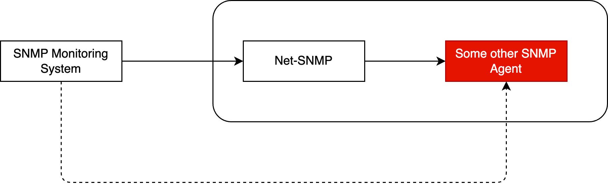

Working with SNMP in 2025 is still a thing.
Most hate it, but it's sometimes the only thing you can use to get insights into the box you are working with.
I want to shed some light on the SNMP proxy capability in Net-SNMP, it might be possible some people haven't heard of it and might find it useful.
In a nutshell, you can use Net-SNMP as a proxy to query information from another SNMP agent over an IP connection you can't or do not want to query directly.



Here are two scenarios, where this might be handy.
You have an SNMP agent running on a piece of gear you can't reach over the network.
A Net-SNMP agent can be placed to bridge that gap.
It would be similar to what you might know as a proxy in the world of HTTP.
The second one, you have an SNMP agent just providing information for a specific purpose.
You can add the specific SNMP agent data as a subtree in Net-SNMP so it looks like it comes all from the same Net-SNMP agent.
In this article, I would like to explore the proxy aspect in detail.

## SNMP Proxy with a full tree replacement

This is a simple lab with two Linux systems running Net-SNMP agents.
The 10.0.0.0/24 network in red can't be reached from the network monitoring system which is in my case OpenNMS Horizon.
The SNMP proxy in Net-SNMP gives you the ability to model the Node in the inventory and monitor it as a regular SNMP node.

☢️ The focus here is on the functionality and educational purpose to understand what's happening.
In production SNMPv3 with strong encryption and authentication should be used.
I use SNMPv2 so you can see on the wire what's happening unencrypted and in plain text.


In my example, the network addresses are assigned as the following.

| Name         | IPv4 address                         |
|:-------------|:-------------------------------------|
| onms-horizon | `192.168.10.10/24`                   |
| snmp-proxy   | `192.168.10.12/24`<br>`10.0.0.10/24` |
| snmp         | `10.0.0.20/24`                       |

The key idea is to differentiate the content of the SNMP tree by a different SNMP community string.
If you use the community string `public1` you get the full tree from the snmp-proxy host itself.
When the community string `public2` is used, you get the full tree from the hidden SNMP agent.

### Step 1: Configure Net-SNMP on the snmp-proxy agent

```shell
## This is just generic contenct to identify the system
sysLocation    SNMP Proxy
sysContact     me@my-domain.lab
sysServices    72

master  agentx

# Make sure you can reach Net-SNMP over the network
agentaddress  udp:161
agentaddress  udp6:161

# Configure a security user context for each community string
# The user is read-only named notConfigUser
com2sec                notConfigUser      default         public1

# The -Cn ctx_hidden is a new introduced context for the proxy
com2sec -Cn ctx_hidden notConfigUser      default         public2

# We assign the read-only user into a group we call notConfigGroup for v1 and v2c
group   notConfigGroup v1            notConfigUser
group   notConfigGroup v2c           notConfigUser

view   systemonly  included   .1.3.6.1.2.1.1
view   systemonly  included   .1.3.6.1.2.1.25.1

# I've added a new view which gives me full access to the SNMP tree 
view   allview     included   .1

# We assign the group for the local ("") context and the proxy context to our view as read-only
access  notConfigGroup ""             any        noauth    exact  allview none   none
access  notConfigGroup ctx_hidden     any        noauth    exact  allview none   none

# The proxy context configuration, where we replace .1.3 with the remote system 10.0.0.20 
proxy -Cn ctx_hidden -v 2c -c public 10.0.0.20 .1.3

rouser authPrivUser authpriv -V systemonly

includeDir /etc/snmp/snmpd.conf.d
```

### Step 2: Configure the Net-SNMP agent on the hidden system

This is just an open config Net-SNMP config, getting the full tree 
```shell
sysLocation    Hidden SNMP
sysContact     me@my-domain.lab
sysServices    72

master  agentx

# Enable network access to the Net-SNMP agent
agentaddress  udp:161
agentaddress  udp6:161

view   systemonly  included   .1.3.6.1.2.1.1
view   systemonly  included   .1.3.6.1.2.1.25.1

# We expose the full tree and don't apply views
rocommunity  public default
rocommunity6 public default

rouser authPrivUser authpriv -V systemonly

includeDir /etc/snmp/snmpd.conf.d
```

### Step 3: Testing from the CLI

Connect to your monitoring system and run the following command:

```shell
snmpget -On -v 2c -c public1 192.168.10.12 sysLocation.0
```

This should give you you the content for the SNMP Proxy
```shell
.1.3.6.1.2.1.1.6.0 = STRING: SNMP Proxy
```

Running the same command with the `public2` community 
```shell
snmpget -On -v 2c -c public2 192.168.10.12 sysLocation.0
```

This should give you the response proxied from the hidden SNMP agent.
```shell
.1.3.6.1.2.1.1.6.0 = STRING: Hidden SNMP
```

### Looking at the wire

When you issue the command and you look at the wire, will see the following communication pattern.


When you run the `snmpget` command and look at the wire, you will see the following communication pattern.
The blue one is the syslocation request against the snmp-proxy host itself.
In the red square, you see the communication from the SNMP proxy to the hidden SNMP server and back.
Another interesting part is the request/response is identified by the SNMP request ID.
The first request is 55454 and the proxy request is 64225.

### Configuring OpenNMS Horizon

How would you set up the monitoring for this scenario in OpenNMS.

#### Step 1: Configure SNMP community strings

💁‍♀️ I recommend starting first with configuring the SNMP community strings before adding Nodes into the system.

Configure the SNMP community string for the SNMP proxy host as usual.
Create also an SNMP community string for the hidden SNMP server.


Use the 10.0.0.20 as the "First IP Address" and fill in the field for "Proxy Host" using the 192.168.10.12 address.
Ensure you use the community string "public2" from your proxy context.

#### Step 2: Add your SNMP proxy to the inventory

Add your SNMP proxy server using a requisition and synchronize it.
OpenNMS should detect and monitor SNMP services and fetch SNMP metrics like any other Net-SNMP host in your system.

#### Step 3: Add your hidden SNMP server to the inventory

Create a requisition just with the SNMP detector for the hidden server. The other detectors won't work.
Create a Node with the network interface 10.0.0.20 address and synchronize the requisition.
You should have now the same SNMP monitoring functionality as any other SNMP host for your hidden SNMP server.


The SNMP server should only have SNMP as a monitored service.
SNMP functions like SNMP metric collection works as usual and transparently.


## What about SNMP bulk requests

An interesting question comes up when we talk about using SNMP bulk requests against the hidden SNMP server.
In a nutshell, SNMP bulk requests gives you two key features:

1. Request more than just one variable in each request (max varbinds)
2. An agent can respond with more than just the requested variables from a repeating table (max repetitions)

Both address efficiency in the sense of getting data with less communication overhead with a tradeoff against latency and device workload.
The default for both is 10 which means if a monitoring system gets 10 variables per SNMP packet and an agent gives you 10 rows more than it has just asked when you have a large table.
Let's see what this looks like on the wire for the SNMP agent we proxy for.


In the case of the SNMP proxy configuration, the getBulkRequest is turning into a sequential get-next-request to the hidden SNMP server behind the proxy.
This has an efficiency impact when you have to deal with complex and very large SNMP data you want to collect through a proxy.

So long and gl & hf

Teaser image by [Lorry McCarthy](https://pixabay.com/users/lorrym-3465282/?utm_source=link-attribution&utm_medium=referral&utm_campaign=image&utm_content=7204017) from [Pixabay](https://pixabay.com//?utm_source=link-attribution&utm_medium=referral&utm_campaign=image&utm_content=7204017).