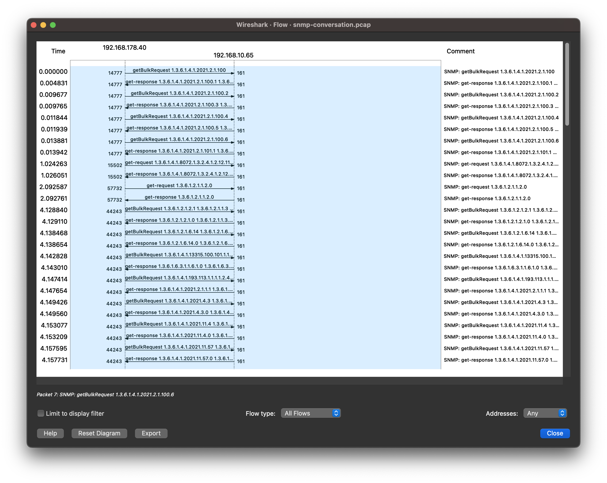
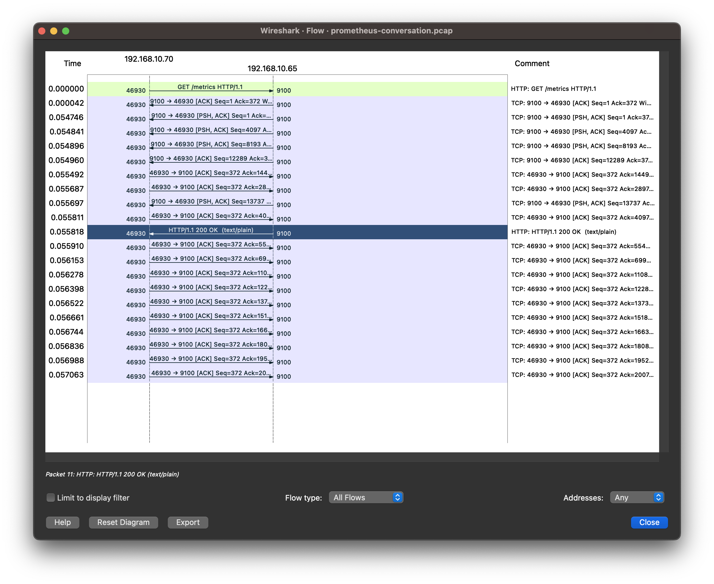
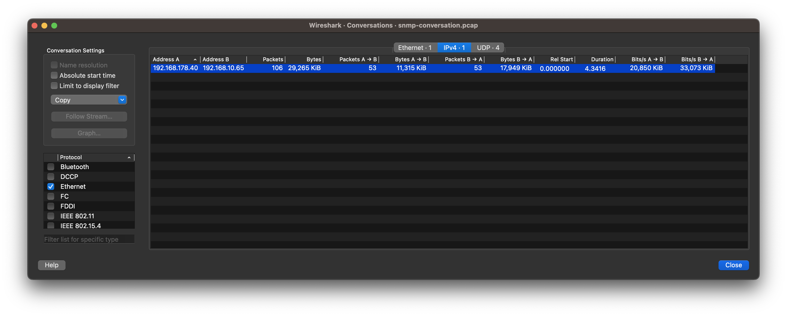
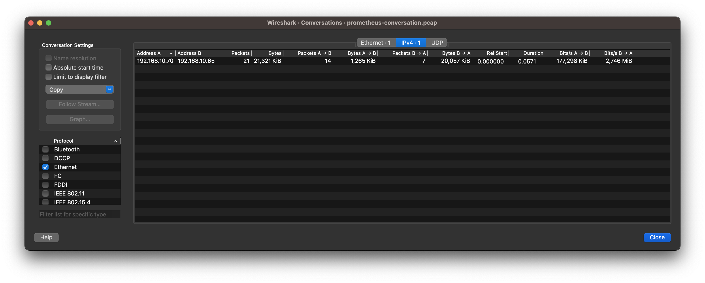

I've been working with network monitoring tools for a long time.
Working with network devices, there is still today a very high probability you have to deal with SNMP.
If you work with modern applications or infrastructure, especially in dynamic environments with containers, you will inevitably run into Prometheus and its ecosystem when you need to design and build monitoring solutions.

By design, both agents have different goals in mind.
The world was very different when SNMP aimed to be "simple" in 1980
as it was for Prometheus in 2012.
To give you some idea, this was the world when people worked with SNMP RFCs in [1983](https://www.computerhistory.org/internethistory/1980s/):

> In January, the ARPANET standardizes on the TCP/IP protocols adopted by the Department of Defense (DOD). The Defense Communications Agency decides to split the network into a public ‘ARPANET’ and a classified ‘MILNET, ‘ with only 45 hosts remaining on the ARPANET. Jon Postel issues an RFC assigning numbers to the various interconnected nets. Barry Leiner takes Vint Cerf’s place at DARPA, managing the Internet.

The design goal was to specify a protocol that covers not just monitoring aspects, but also management aspects from fault, configuration, accounting, performance, and security. As you can imagine there is a lot to cover. Monitoring tools mostly just use the SNMP agent to get insights from the device and give you visibility. The Prometheus exporter on the contrary is just doing this one thing and that's it.

Prometheus seems well adapted, and there is not much which doesn't have a Prometheus exporter or a /metrics endpoint out of the box.
Prometheus is a [graduated](https://www.cncf.io/projects/) [CNCF project](https://www.cncf.io/projects/prometheus/).
The trademark is in control of the Linux Foundation.

As always, people argue a lot about which one is better and I would like to bust a few myths about the two. Here are some of my personal favorites:

1. SNMP uses not as much network bandwidth because it is very efficient
2. SNMP has a simple request/response communication pattern that allows you to do the same job in less time.

Just by looking at the communication protocols, they are using very different approaches.
SNMP uses UDP as a connectionless protocol for communication.
Prometheus, on the other side, uses HTTP via TCP as a connection-oriented protocol.

Let's have a look at the wire with a very simple scenario.
We use a Linux system with Net-SNMP installed and use OpenNMS as a management system.
With an out-of-the-box configuration, OpenNMS collects 1116 metrics[^1].
When you install the Prometheus Node-Exporter you get 1965 metrics[^2].
The question is, which one is more efficient on the wire? Pretty easy to look at, run a TCP dump and analyze the conversation.

Comparing SNMP and Prometheus, shows UDP isn't as efficient when it comes to packets and collection time.
It ends up with more messages to get the 1116 data points across the wire.
Traversing the SNMP tree and getting the response is also slower then just getting the metrics from an /metrics endpoint.

It takes ~4.3 seconds to fetch it from SNMP, whereas the Prometheus agent can scrape it in 0.06 seconds, ~70x faster collecting 849 additional data points.
Using SNMP, your network needs to forward 106 packets vs. just 21 packets using Prometheus.
The communication pattern between the two is very different.
With SNMP you have bulked requests for OIDs in a sequence of requests.
SNMP needs more payload traversing the tree grouping OID's in several bulk-requests.
The manager sends 11.315 KiB in requests and gets 17.949 KiB in return.

Prometheus is just asking a metrics endpoint with a GET request.
With Prometheus you have just 1.265 KiB for the request and 20.057 KiB as a response.
The data crossing in summary on the wire isn't very different but shiftet a bit, due to stateless vs. stateful communication patterns.

In conclusion, scraping metrics with Prometheus is fast.
I guess, Prometheus can leverage a lot from highly optimized network code around HTTP.
With TCP it might be trickier to establish TCP connections in congested unreliable networks.
If you pick UDP you might have a chance to get at least parts of it across the wire when you have unreliable or congested links.
In case you deploy a very large centralized monitoring solution, having ~5x packets to transmit, might be a topic when devices with limited packet forwarding capacity are traversed.
So as always it depends on your requirements and use cases and HTTP/TCP vs. SNMP/UDP isn't that bad as you might think.

So long and thanks for all the fish

[^1]: Exported JSON payload from [snmp.pcap](./snmp.pcap).
[^2]: Metric count from the plain text response in the [prometheus.pcap](./prometheus.pcap).
