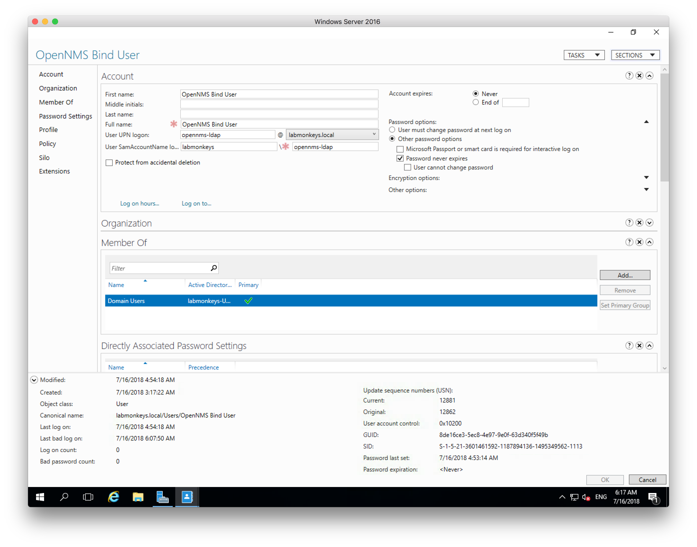
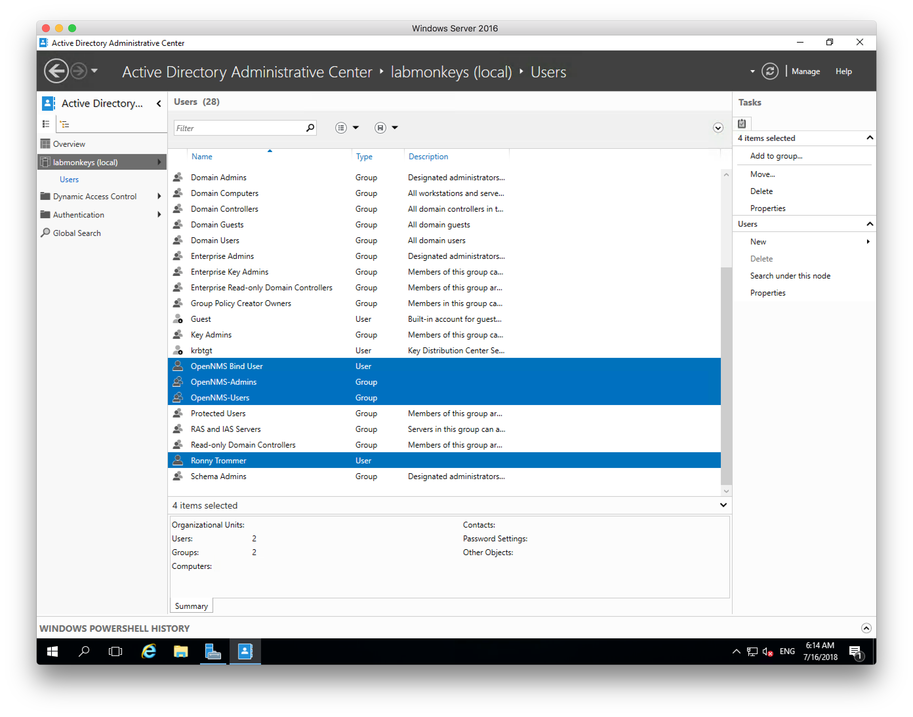

Centralized authentication is a core service as soon you have a network with more the 3 computers.
How do you authenticate a OpenNMS Horizon 22.0.1 against an Active Directory provided on a Microsoft Windows Server 2016.
We focus here on the Active Directory and Spring authentication parts, securing the connection with LDAPS and using self-signed certificates in Java is another topic.

In this example the domain is called `labmonkeys.local` and the Microsoft Windows Server has the IP address 192.168.178.220.
The user name for the bind user is `OpenNMS Bind User` with the password `MyPass123!`.

We want to have two Active Directory groups, one named `OpenNMS-Admins` and a second one name `OpenNMS-Users` and we only want to allow users in these groups to login to the OpenNMS Horizon web application.
The user within the group `OpenNMS-Admins` can configure OpenNMS Horizon and the user in `OpenNMS-Users` are regular OpenNMS Horizon users without access to the administration area in the Web UI.

***Step 1: Create an user which to bind against LDAP to execute search queries***


***Step 2: Create the Groups in Active Directory and assign the Users into the groups***


***Step 3: Test the connection with ldapsearch and the bind user from your OpenNMS Horizon server***
```sh
ldapsearch -x \
  -D 'cn=OpenNMS Bind User,cn=Users,dc=labmonkeys,dc=local' -W \
  -b 'cn=Users,dc=labmonkeys,dc=local' -h 192.168.178.220
```

***Step 4: Enable external authentication in OpenNMS Horizons Spring security context***
```sh
vi ${OPENNMS_HOME}/jetty-webapps/opennms/WEB-INF/applicationContext-spring-security.xml
```

Uncomment the following line:
```xml
<authentication-provider ref="externalAuthenticationProvider" />
```

***Step 5: Enable the external Active Directory Authentication security context***
```sh
cd ${OPENNMS_HOME}/jetty-webapps/opennms/WEB-INF/spring-security.d/
cp activeDirectory.xml.disabled activeDirectory.xml
```

***Step 6: Configure LDAP server for authentication***
```xml
<beans:bean id="contextSource" class="org.springframework.ldap.core.support.LdapContextSource">
  <beans:property name="urls">
    <beans:list>
      <!-- List one or more of your Active Directory domain controllers here -->
      <beans:value>ldap://192.168.178.220:389/</beans:value>
    </beans:list>
  </beans:property>
  <!-- An optional base DN. Every user and group below is relative to this. -->
  <beans:property name="base" value="dc=labmonkeys,dc=local" />
  <beans:property name="authenticationSource" ref="authenticationSource" />
</beans:bean>
```

***Step 7: Configure bind user to search for LDAP objects***
```xml
 <beans:bean id="authenticationSource" class="org.springframework.ldap.authentication.DefaultValuesAuthenticationSourceDecorator">
  <beans:property name="target" ref="springSecurityAuthenticationSource"/>
  <!-- Identify an unprivileged user for initial binding to the directory -->
  <!-- In some cases, expressing the user as an LDAP DN is the right way -->
  <beans:property name="defaultUser" value="CN=OpenNMS Bind User,CN=Users,DC=labmonkeys,DC=local"/>
  <!-- In other cases, it's necessary to express it in user@domain format -->
  <!-- <beans:property name="defaultUser" value="opennms_bind@example.org"/> -->
  <!-- Specify the unprivileged bind user's password here -->
  <beans:property name="defaultPassword" value="MyPass123!"/>
</beans:bean>
```

***Step 8: Set the user search to `CN=Users`***
```xml
<beans:bean id="userSearch" class="org.springframework.security.ldap.search.FilterBasedLdapUserSearch">
  <beans:constructor-arg index="0" value="CN=Users" />

  <!-- More complex filters are possible depending on the layout of your directory -->
  <beans:constructor-arg index="1" value="(sAMAccountName={0})" />
  <beans:constructor-arg index="2" ref="contextSource" />
  <beans:property name="searchSubtree" value="true" />
</beans:bean>
```

***Step 9: Restart OpenNMS Horizon and login with your Active Directory User***

For troubleshooting you can watch the Jetty web log.
```sh
tail -f ${OPENNMS_HOME}/logs/jetty-server.log | grep "LDAP:"
```
