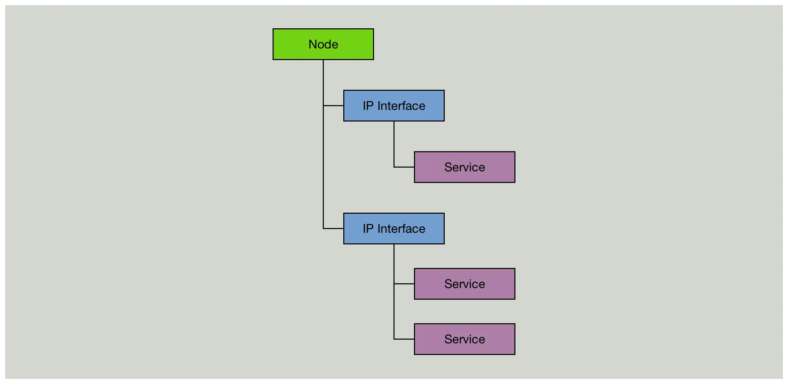
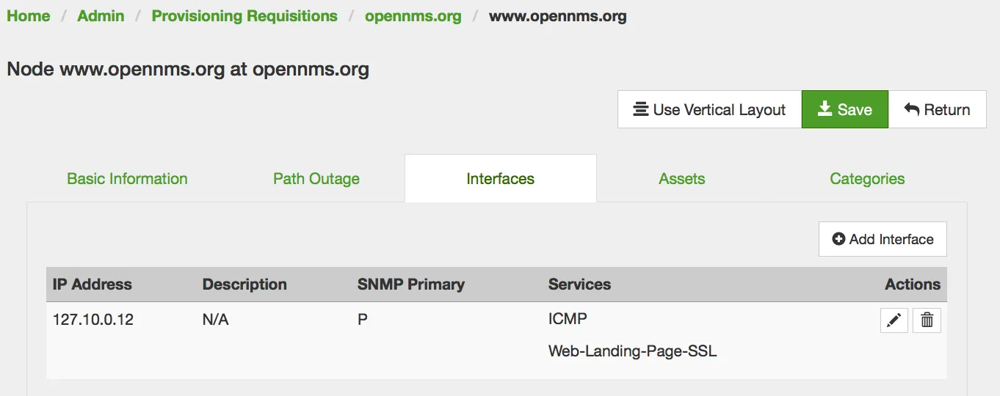

Monitoring websites is a common requirement.
Using OpenNMS to monitor websites can be done by using the built in HTTP/HTTPS based monitors.

While a "Node" can be pretty much everything in a network, the internal model to monitor something is pretty old-fashioned and static.
Monitoring a service requires to assign a service to an IP address.



This article describes a pattern how you can monitor web sites with low maintenance and without the need to maintain for each website a monitor which is cumbersome in maintenance.

### The Use Case

We want to monitor the websites landing page from https://www.opennms.org.

The landing page is what you get when you type in your browser "https://www.opennms.org/", the important thing is the path `/` at the end.

### Step 1: Use the ${nodelabel} variable

The Page Sequence Monitor allows you to pass the `${nodelabel}` into the running monitor.
I've called the monitor _Web-Landing-Page-SSL_.
It's just a name and you can use a different one as you like, just make sure you provision the correct service name you've picked.

Here is the full service definition for the `poller-configuration.xml` to test the websites entry page:

```xml
<service name="Web-Landing-Page-SSL" interval="300000" user-defined="true" status="on">
    <parameter key="retry" value="1"/>
    <parameter key="timeout" value="5000"/>
    <parameter key="rrd-repository" value="/opt/opennms/share/rrd/response"/>
    <parameter key="ds-name" value="webLandingSsl"/>
    <parameter key="page-sequence">
        <page-sequence>
            <page path="/"
                    scheme="https"
                    port="443"
                    host="${nodelabel}"
                    virtual-host="${nodelabel}"
                    requireIPv4="false"
                    requireIPv6="false"
                    disable-ssl-verification="false"
                    response-range="200-399"/>
        </page-sequence>
    </parameter>
</service>

<monitor service="Web-Landing-Page-SSL" class-name="org.opennms.netmgt.poller.monitors.PageSequenceMonitor"/>
```

The basic test parameters are defined in the beginning and are self explaining:

```xml
<service name="Web-Landing-Page-SSL" interval="300000" user-defined="true" status="on">
    <parameter key="retry" value="1"/>
    <parameter key="timeout" value="5000"/>
    <parameter key="rrd-repository" value="/opt/opennms/share/rrd/response"/>
    <parameter key="ds-name" value="webLandingSsl"/>
```

When you use _RRDTool_ or _JRobin_, OpenNMS stores respone time is stored in a file named `webLandingSsl{.rrd,.jrb}` the directory of the IP interface in `{OPENNMS_HOME}/share/rrd/response`.
The test for the website itself is defined in the `page sequence` section.

```xml
<page-sequence>
    <page path="/"
            scheme="https"
            port="443"
            host="${nodelabel}"
            virtual-host="${nodelabel}"
            requireIPv4="false"
            requireIPv6="false"
            disable-ssl-verification="false"
            response-range="200-399"/>
</page-sequence>
```

A _HTTP GET_ request would be like this `curl -I https://${nodelabel}/`, where the parameter `${nodelabel}` is replaced accordingly on which node the service is running.
The _HTTP Respose Code_ should be something between `200-399` to have the service _Up_, every other response code outside of the range the service goes _Down_.


For websites you probably want to resolve the host dynamically to an IP address.
They can change or use Round Robin DNS so the IP would be always different.

```xml
requireIPv4="false"
requireIPv6="false"
```

This tells the _Page Sequence Monitor_ to not use the IP address where the service is assigned to and make a DNS lookup using the system configuration and run the test against the resolved IP address.

### Step 2: Provision a node per website

The tricky question is: "Which IP should I assign to a node, cause it is mandantory?".
If you run OpenNMS on a Linux system you can pick a unique IP address for each website from the `127/8` loopback IP range.
They will always be reachable and respond to ICMP by the systems local IP stack.



Assign the _Web-Page-Landing-SSL_ monitor to the loopback IP.
If you want to have a more detailed error message and not just a _nodeDown_ event in case the website is unavailable, provision the _ICMP_ service on the loopback IP.
The _ICMP_ service will always be available and you will get a _nodeLostService_ with a more detailed error message why the _Web-Page-Landing-SSL_ service went down.

### Add diagnostic test for DNS resolution

With a similar pattern you can add a test to resolve the websites hostname as additional diagnostic information.

```xml
<service name="DNS-Resolution-v4" interval="300000" user-defined="false" status="on">
    <parameter key="retry" value="2"/>
    <parameter key="timeout" value="2000"/>
    <parameter key="resolution-type" value="v4"/>
    <parameter key="rrd-repository" value="/opt/opennms/share/rrd/response"/>
    <parameter key="rrd-base-name" value="dns-res-v4"/>
    <parameter key="ds-name" value="dns-res-v4"/>
</service>
<service name="DNS-Resolution-v6" interval="300000" user-defined="false" status="on">
    <parameter key="retry" value="2"/>
    <parameter key="timeout" value="2000"/>
    <parameter key="resolution-type" value="v6"/>
    <parameter key="rrd-repository" value="/opt/opennms/share/rrd/response"/>
    <parameter key="rrd-base-name" value="dns-res-v6"/>
    <parameter key="ds-name" value="dns-res-v6"/>
</service>

<monitor service="DNS-Resolution-v4" class-name="org.opennms.netmgt.poller.monitors.DNSResolutionMonitor" />
<monitor service="DNS-Resolution-v6" class-name="org.opennms.netmgt.poller.monitors.DNSResolutionMonitor" />
```

By default the DNSResolution Monitor will use the _Node Label_ as lookup for an _A record_.
The IP interface doesn't matter, the test will use the system DNS configuration.
If you want a more customized DNS test, have a look at the [DNSResolutionMonitor documentation](http://docs.opennms.org/opennms/releases/latest/guide-admin/guide-admin.html#poller-dns-resolution-monitor).

Happy Monitoring
